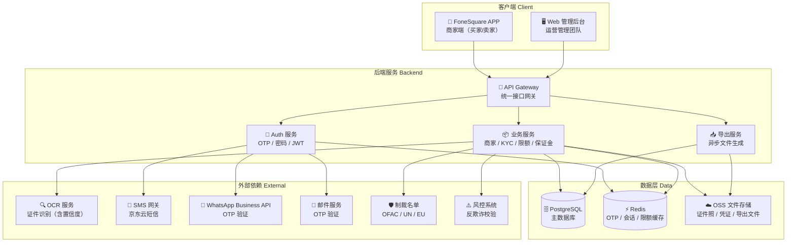
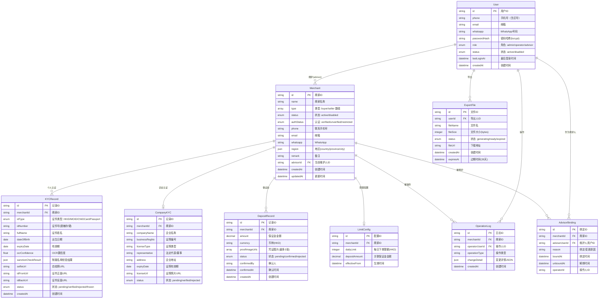

# FoneSquare 系统总览

## 项目概要

FoneSquare 是一个**海外 B2B 二手手机交易平台**：

- **APP 端**：面向海外商家（买家/卖家），提供注册登录、KYC 实名认证、浏览商品、下单购买等功能
- **Web 管理后台**：面向 FoneSquare 运营管理团队，使用 OB 账号体系登录，覆盖商家全生命周期管理：商家录入、KYC 资质查看、每日限额配置、维护人（销售/顾问）绑定与数据权限隔离
- **核心业务**：海外回收商通过 APP 在 FoneSquare 平台下单采购二手手机，平台通过 KYC 认证、保证金机制、每日限额等手段进行风控管理

---

## 系统架构图

---

## 实体关系图

---

## 技术栈建议

| 层级 | 技术选型 | 说明 |
|------|----------|------|
| **APP 前端** | React Native / Flutter | 跨平台 APP，支持 iOS + Android |
| **Web 前端** | React + TypeScript + Ant Design | 管理后台，支持中英文 i18n |
| **后端框架** | Node.js (NestJS) / Java (Spring Boot) / Go | RESTful API，JWT 鉴权 |
| **数据库** | PostgreSQL | 主数据库，JSONB 支持 |
| **缓存** | Redis | OTP 验证码、会话、限额计数、防刷限流 |
| **文件存储** | 阿里云 OSS / AWS S3 | 证件照、保证金凭证、导出文件 |
| **OCR** | 第三方 OCR 服务 | 证件识别，返回置信度 |
| **SMS** | 京东云短信 | Phone OTP |
| **消息推送** | WhatsApp Business API / 邮件服务 | WhatsApp OTP / Email OTP |
| **风控** | 制裁名单 API（OFAC/UN/EU） | KYC 合规校验 |

---

## MVP 功能范围清单

### P0 核心功能（MVP 必须）

| 模块 | 功能 | 说明 |
|------|------|------|
| **APP - 登录注册** | Phone OTP 登录 | 手机号 + 短信验证码登录/注册一体化 |
| **APP - 登录注册** | WhatsApp OTP 登录 | WhatsApp 验证码登录/注册 |
| **APP - 登录注册** | Email OTP 登录 | 邮箱验证码登录/注册 |
| **APP - 登录注册** | 密码设置 | 首次登录后引导设置密码，后续密码+OTP双通道 |
| **APP - KYC** | 个人实名认证 | 证件拍照 → OCR 识别 → 制裁名单校验 → 自动认证 |
| **APP - KYC** | 企业认证（选填） | 营业执照上传，OCR 识别 |
| **Web - 商家管理** | 商家列表 | 列表+筛选+分页+导出，维护人数据隔离 |
| **Web - 商家管理** | 商家详情 | 基本信息、KYC材料、限额保证金、维护人绑定、操作日志 |
| **Web - 商家管理** | 添加商家 | 单页表单录入，含 KYC 信息，证件唯一性校验 |
| **Web - 限额管理** | 每日下单限额 | 配置每日限额（HKD），保证金×10=上限 |
| **Web - 保证金** | 保证金管理 | 填写金额、上传凭证、确认状态 |
| **Web - 权限** | 功能权限+数据权限 | 管理员全量，维护人仅绑定商家 |
| **Web - 维护人** | 维护人绑定/解绑/更换 | 含变更原因，记录操作日志 |
| **Web - 日志** | 操作日志 | 所有变更记录，含修改前后值 |

### P1 增强功能

| 模块 | 功能 | 说明 |
|------|------|------|
| **APP - KYC** | KYC 重新提交 | 修改认证信息后重新走 OCR + 风控流程 |
| **APP - KYC** | 重复证件引导 | 检测到证件已注册时引导至已有账号 |
| **Web - 导出** | 下载中心 | 异步导出，30 天有效，支持重新生成 |
| **Web - 国际化** | 中英文切换 | 管理后台支持简体中文 + English |
| **Web - 商家管理** | 商家启用/停用 | 状态切换，停用后不可下单 |
| **Web - 资质** | KYC 验证记录 | 认证日志，含验证类型/结果/失败原因 |
| **通用** | 多语言本地化 | APP 端 EN/zh-CN/zh-HK |
| **通用** | 时区处理 | 后端 UTC+8 存储，APP 端展示本地时区 |

---

## 全局业务规则

1. **认证状态影响下单**：未认证 → 不可下单；已认证 → 可正常下单
2. **保证金与限额关联**：保证金金额 × 10 = 每日下单限额上限
3. **每日限额计算**：当日累计（已支付+未支付，不含取消）订单金额（HKD）≥ 限额时禁止下单
4. **证件唯一性**：同一证件号只能关联一个商家账号，不做账号合并，引导至已有账号
5. **OTP 防刷**：同一号码 60 秒内不可重发，每小时/每日有发送上限
6. **JWT Token**：有效期 90 天，支持多设备登录
7. **密码加密**：bcrypt 加密存储
8. **操作日志**：所有关键操作（编辑、状态变更、绑定变更、限额修改）均记录操作人、修改前后值、时间
