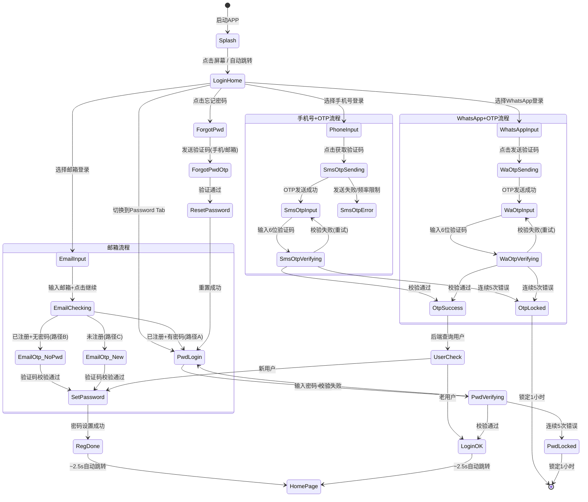

# 10-auth-login — APP 登录注册

> **来源**: FoneSquare-PRD-v2.html · 登录/注册模块
> **优先级**: P0 核心
> **最后更新**: 2026-05-07

---

## 1. 页面定位

APP 端多渠道登录注册入口，支持手机号+OTP、WhatsApp+OTP、邮箱+密码三种方式，采用「渐进式注册」策略——用户 30 秒内完成注册即可浏览商品，KYC 认证延迟到首次下单前触发。

---

## 2. 状态机



---

## 3. 组件树

```
LoginModule/
├── SplashScreen                    // 开屏页
├── LoginHomePage                   // 登录首页
│   ├── LanguageSwitcher            // 语言切换(EN/简体/繁體)
│   ├── PhoneTab                    // 手机号Tab
│   │   ├── CountryCodePicker       // 国家区号选择器(200+国家)
│   │   └── PhoneInput              // 手机号输入框
│   ├── PasswordTab                 // 密码Tab
│   │   ├── AccountInput            // 手机号/邮箱输入
│   │   ├── PasswordInput           // 密码输入框(含显示/隐藏)
│   │   └── ForgotPasswordLink      // 忘记密码链接
│   ├── LoginButton                 // 登录/注册按钮
│   ├── SocialLoginDivider          // "Or continue with" 分隔线
│   ├── WhatsAppLoginEntry          // WhatsApp登录入口
│   ├── EmailLoginEntry             // 邮箱登录入口
│   └── TermsFooter                 // 服务条款+隐私政策
├── WhatsAppInputPage               // WhatsApp号码输入页
│   ├── CountryCodePicker
│   └── WhatsAppNumberInput
├── EmailInputPage                  // 邮箱输入页
│   └── EmailInput
├── OtpVerifyPage                   // OTP验证页(SMS/WhatsApp/Email通用)
│   ├── OtpCodeInput[6]             // 6位验证码输入框(自动聚焦)
│   ├── CountdownTimer              // 60s重发倒计时
│   ├── ResendButton                // 重新发送按钮
│   └── VerifyButton                // 验证+继续按钮
├── SetPasswordPage                 // 密码设置页(通用于所有注册方式)
│   ├── NewPasswordInput            // 新密码输入
│   ├── ConfirmPasswordInput        // 确认密码输入
│   ├── PasswordStrengthIndicator   // 密码强度指示器
│   └── SetPasswordButton           // 设置密码按钮
├── RegistrationDonePage            // 注册完成过渡页
│   ├── SuccessAnimation            // 成功动画
│   ├── ProgressBar                 // ~2.5s进度条
│   └── AutoRedirect                // 自动跳转首页
├── LoginOKPage                     // 登录成功过渡页
│   ├── WelcomeBackText             // "Welcome Back!"
│   └── AutoRedirect                // ~2.5s自动跳转
└── ForgotPasswordSheet             // 忘记密码底部弹层
    ├── TabBar(Phone/Email)         // 手机号/邮箱切换Tab
    ├── Step1_SendCode              // 发送验证码
    ├── Step2_VerifyOtp             // 验证OTP
    └── Step3_ResetPassword         // 重设密码
```

---

## 4. 字段清单

### 4.1 手机号登录

| 字段名 | 类型 | 必填 | 校验规则 | 说明 |
|--------|------|------|----------|------|
| country_code | string | 是 | 有效国际区号(+1~+999) | 默认按IP定位匹配，CN→+86，HK→+852 |
| phone_number | string | 是 | 去除空格后纯数字，长度5-15位 | 手机号即用户唯一标识 |
| otp_code | string | 是 | 6位纯数字 | 有效期5分钟 |

### 4.2 WhatsApp登录

| 字段名 | 类型 | 必填 | 校验规则 | 说明 |
|--------|------|------|----------|------|
| country_code | string | 是 | 有效国际区号 | 默认填充国家区号 |
| whatsapp_number | string | 是 | 去除空格后纯数字，长度5-15位 | 与手机号相同时自动关联同一账号 |
| otp_code | string | 是 | 6位纯数字 | 通过WhatsApp Business API模板消息发送 |

### 4.3 邮箱登录

| 字段名 | 类型 | 必填 | 校验规则 | 说明 |
|--------|------|------|----------|------|
| email | string | 是 | RFC 5322邮箱格式 | 大小写不敏感，存储时统一小写 |
| email_otp | string | 条件必填 | 6位纯数字 | 路径B/C需要 |
| password | string | 条件必填 | 8-20位，至少包含字母+数字 | 路径A登录需要 |

### 4.4 密码设置（通用）

| 字段名 | 类型 | 必填 | 校验规则 | 说明 |
|--------|------|------|----------|------|
| new_password | string | 是 | 8-20位，至少包含字母和数字 | 新密码 |
| confirm_password | string | 是 | 必须与new_password完全一致 | 确认密码 |

### 4.5 密码登录Tab

| 字段名 | 类型 | 必填 | 校验规则 | 说明 |
|--------|------|------|----------|------|
| account | string | 是 | 手机号/邮箱/WhatsApp号 | 支持任意已绑定的登录方式 |
| password | string | 是 | 8-20位 | 密码 |

### 4.6 忘记密码

| 字段名 | 类型 | 必填 | 校验规则 | 说明 |
|--------|------|------|----------|------|
| mode | enum | 是 | `phone` \| `email` | Tab切换选择验证模式 |
| phone / email | string | 是 | 同上对应规则 | 根据mode决定 |
| otp_code | string | 是 | 6位纯数字 | 验证码 |
| new_password | string | 是 | 8-20位，字母+数字 | 新密码 |
| confirm_password | string | 是 | 与new_password一致 | 确认密码 |

---

## 5. 交互规则

| 编号 | 规则 |
|------|------|
| IR-001 | 登录首页默认展示 Phone Tab，底部 "Or continue with" 下方并排展示 WhatsApp 和 Email 入口 |
| IR-002 | 国家区号选择器支持搜索过滤，列表按字母排序，常用区号(+852/+86/+63/+971)置顶 |
| IR-003 | 手机号输入框在输入过程中禁止非数字字符，自动去除空格和横杠 |
| IR-004 | OTP 输入页自动聚焦第一个输入框，输入满6位后自动提交验证 |
| IR-005 | OTP 输入页展示60秒倒计时，倒计时结束前重发按钮灰化不可点 |
| IR-006 | OTP 发送后展示脱敏手机号/邮箱(如 +852****1234 / j***@gmail.com) |
| IR-007 | 密码输入框支持明文/密文切换(👁️图标) |
| IR-008 | 密码设置页实时强度指示器：弱(纯数字/纯字母) → 中(字母+数字) → 强(字母+数字+特殊字符) |
| IR-009 | 注册完成过渡页展示 "Registration Complete!" + 进度条动画，约2.5秒自动跳转首页 |
| IR-010 | 登录成功过渡页展示 "Welcome Back!" + 自动跳转动画，约2.5秒后自动跳转首页，无按钮 |
| IR-011 | 忘记密码为底部弹层(Bottom Sheet)，支持 📱 Phone / ✉️ Email 两个Tab切换 |
| IR-012 | 忘记密码弹层分3步：Step1 输入手机/邮箱并发送验证码 → Step2 输入验证码 → Step3 设置新密码 |
| IR-013 | 邮箱登录流程：输入邮箱后系统自动判断注册状态，路径A直接展示密码框，路径B/C发送验证码 |
| IR-014 | 语言切换器位于登录页右上角，点击后展示三选一：English / 简体中文 / 繁體中文 |
| IR-015 | 所有错误提示使用 Toast 或内联错误文案，不使用弹窗打断流程 |
| IR-016 | 密码设置页在注册场景中**不可跳过**，无返回/关闭按钮 |

---

## 6. 业务规则

| 编号 | 规则 |
|------|------|
| BR-001 | **OTP 全局规则**：6位纯数字，有效期5分钟，重发间隔60秒 |
| BR-002 | **OTP 频率限制**：同号码60秒限发1次，同号码每天≤10次，同IP每小时≤10次 |
| BR-003 | **OTP 错误锁定**：连续验证错误5次，锁定1小时（锁定期间不可发送新OTP） |
| BR-004 | **SMS 通道**：京东云国际SMS服务，支持200+国家/地区 |
| BR-005 | **WhatsApp 通道**：官方 Business API 直连，OTP模板(fonesquare_otp)需提前通过Meta Business审核。本期不使用第三方(Twilio等)中转 |
| BR-006 | **WhatsApp 模板消息**："Your verification code is {{1}}. This code expires in 5 minutes." |
| BR-007 | **账号关联**：WhatsApp号码与手机号相同时自动关联为同一账号（按号码全匹配） |
| BR-008 | **密码强制**：所有注册方式（手机号/WhatsApp/邮箱）的新用户必须设置密码，不可跳过 |
| BR-009 | **密码规则**：8-20位，至少包含字母和数字，bcrypt 加密存储 |
| BR-010 | **JWT Token**：有效期90天，签发时包含 uid、login_method、device_id |
| BR-011 | **多设备登录**：新设备登录签发新Token，不主动踢出旧设备。同一账号最多保持3个活跃会话 |
| BR-012 | **邮箱注册**：不做账号关联检测（注册阶段无手机号信息），合并延迟到KYC阶段 |
| BR-013 | **忘记密码-手机号模式**：通过手机号发送OTP验证码，验证通过后重设密码 |
| BR-014 | **忘记密码-邮箱模式**：通过邮箱发送验证码，验证通过后重设密码 |
| BR-015 | **注册后不引导KYC**：首页不展示KYC入口/banner，底部导航为 Home · Cart · Me |
| BR-016 | **制裁名单校验**：注册阶段不做风控校验，仅在KYC身份认证阶段执行 |
| BR-017 | **密码登录错误锁定**：连续错误5次锁定1小时 |
| BR-018 | **i18n**：代码无中文硬编码，所有文案抽离到语言包(en/zh-CN/zh-HK)，以 locale 维度管理 |
| BR-019 | **默认locale推断**：设备系统语言 + IP地理位置 → CN→简体中文，HK→繁体中文，其他→English |

---

## 7. 前端实现要点

### 7.1 路由

```
/splash                    → SplashScreen
/login                     → LoginHomePage (默认Phone Tab)
/login/whatsapp            → WhatsAppInputPage
/login/email               → EmailInputPage
/otp/verify                → OtpVerifyPage (query: type=sms|whatsapp|email)
/auth/set-password         → SetPasswordPage
/auth/registration-done    → RegistrationDonePage
/auth/login-ok             → LoginOKPage
/home                      → HomePage
```

### 7.2 状态管理

```typescript
interface AuthState {
  step: 'idle' | 'otp_sent' | 'otp_verifying' | 'set_password' | 'done';
  loginMethod: 'phone' | 'whatsapp' | 'email' | 'password';
  countryCode: string;         // 当前选择的国家区号
  phoneNumber: string;
  email: string;
  otpResendCountdown: number;  // 60s倒计时
  otpAttempts: number;         // OTP错误次数
  isLocked: boolean;           // 是否被锁定
  lockExpiresAt: string | null;
  token: string | null;        // JWT
  isNewUser: boolean;          // 新用户标识
  locale: 'en' | 'zh-CN' | 'zh-HK';
  deviceTimezone: string;      // IANA格式
}
```

### 7.3 API 调用

| 接口 | 方法 | 路径 | 说明 |
|------|------|------|------|
| 发送SMS OTP | POST | `/api/v1/auth/otp/sms/send` | body: `{ country_code, phone_number }` |
| 发送WhatsApp OTP | POST | `/api/v1/auth/otp/whatsapp/send` | body: `{ country_code, whatsapp_number }` |
| 发送邮箱验证码 | POST | `/api/v1/auth/otp/email/send` | body: `{ email }` |
| 验证OTP | POST | `/api/v1/auth/otp/verify` | body: `{ type, identifier, otp_code }` → `{ token, is_new_user }` |
| 检查邮箱状态 | POST | `/api/v1/auth/email/check` | body: `{ email }` → `{ status: 'registered_with_pwd' \| 'registered_no_pwd' \| 'not_registered' }` |
| 密码登录 | POST | `/api/v1/auth/login/password` | body: `{ account, password, device_timezone }` → `{ token }` |
| 设置密码 | POST | `/api/v1/auth/password/set` | body: `{ new_password, confirm_password }` (需Bearer Token) |
| 忘记密码-发送验证码 | POST | `/api/v1/auth/password/forgot/send` | body: `{ mode, identifier }` |
| 忘记密码-验证OTP | POST | `/api/v1/auth/password/forgot/verify` | body: `{ mode, identifier, otp_code }` → `{ reset_token }` |
| 忘记密码-重设密码 | POST | `/api/v1/auth/password/reset` | body: `{ reset_token, new_password, confirm_password }` |

---

## 8. 后端实现要点

### 8.1 校验逻辑

- **OTP 生成**: 6位纯数字随机数，存入 Redis `otp:{type}:{identifier}` → `{ code, attempts, created_at }`，TTL=300s
- **OTP 频率限制**: Redis `otp_rate:{identifier}` 自增计数，TTL=86400s(天级)；`otp_rate_ip:{ip}` 自增计数，TTL=3600s(时级)
- **OTP 错误计数**: Redis `otp_fail:{identifier}` 自增，≥5次时设置 `otp_lock:{identifier}` TTL=3600s
- **密码校验**: bcrypt.compare()，错误计数同理使用 Redis `pwd_fail:{account}`，≥5次锁定1小时
- **邮箱格式校验**: 后端二次校验 RFC 5322，大小写归一化(toLowerCase)

### 8.2 数据库操作

```sql
-- 用户主表
CREATE TABLE users (
    uid           BIGINT PRIMARY KEY AUTO_INCREMENT,
    full_name     VARCHAR(200),
    has_password  BOOLEAN DEFAULT FALSE,
    password_hash VARCHAR(200),
    kyc_status    ENUM('none','pending','approved','rejected','frozen') DEFAULT 'none',
    account_status ENUM('active','suspended','deactivated') DEFAULT 'active',
    locale        VARCHAR(10) DEFAULT 'en',
    created_at    TIMESTAMP DEFAULT CURRENT_TIMESTAMP,
    updated_at    TIMESTAMP DEFAULT CURRENT_TIMESTAMP ON UPDATE CURRENT_TIMESTAMP
);

-- 登录方式表（一个用户多种登录方式）
CREATE TABLE user_login_methods (
    id            BIGINT PRIMARY KEY AUTO_INCREMENT,
    uid           BIGINT NOT NULL,
    method_type   ENUM('phone','email','whatsapp') NOT NULL,
    identifier    VARCHAR(200) NOT NULL,  -- 手机号/邮箱/WhatsApp号
    country_code  VARCHAR(10),
    password_hash VARCHAR(200),           -- 邮箱登录方式的独立密码
    is_primary    BOOLEAN DEFAULT FALSE,
    created_at    TIMESTAMP DEFAULT CURRENT_TIMESTAMP,
    UNIQUE KEY idx_method_identifier (method_type, identifier),
    FOREIGN KEY (uid) REFERENCES users(uid)
);

-- 登录会话表
CREATE TABLE user_sessions (
    id              BIGINT PRIMARY KEY AUTO_INCREMENT,
    uid             BIGINT NOT NULL,
    token_hash      VARCHAR(200) NOT NULL,  -- JWT签名的hash
    device_id       VARCHAR(200),
    device_timezone VARCHAR(50),            -- IANA格式
    login_method    VARCHAR(20),
    ip_address      VARCHAR(50),
    expires_at      TIMESTAMP NOT NULL,     -- token过期时间(90天)
    created_at      TIMESTAMP DEFAULT CURRENT_TIMESTAMP,
    FOREIGN KEY (uid) REFERENCES users(uid)
);

-- OTP发送日志
CREATE TABLE otp_logs (
    id          BIGINT PRIMARY KEY AUTO_INCREMENT,
    type        ENUM('sms','whatsapp','email') NOT NULL,
    identifier  VARCHAR(200) NOT NULL,
    ip_address  VARCHAR(50),
    status      ENUM('sent','verified','expired','failed') DEFAULT 'sent',
    created_at  TIMESTAMP DEFAULT CURRENT_TIMESTAMP
);
```

### 8.3 事件触发

| 事件 | 触发时机 | 动作 |
|------|----------|------|
| `user.registered` | 新用户创建成功 | 写入用户表、创建默认登录方式、签发JWT |
| `user.logged_in` | 老用户登录成功 | 更新登录时间、写入会话表、记录device_timezone |
| `user.password_set` | 密码设置成功 | 更新 password_hash、has_password=true |
| `user.password_reset` | 密码重置成功 | 更新 password_hash、清除所有活跃会话(强制重新登录) |
| `otp.sent` | OTP发送成功 | 写入 otp_logs |
| `otp.verified` | OTP验证成功 | 更新 otp_logs 状态 |
| `otp.locked` | 连续错误5次 | 设置Redis锁定标记、写入安全日志 |
| `auth.whatsapp_auto_link` | WhatsApp号与手机号匹配 | 将WhatsApp登录方式绑定到已有手机号账号 |

### 8.4 性能要求

| 指标 | 目标值 |
|------|--------|
| OTP 发送延迟 | ≤ 5秒 |
| 登录页首屏加载 | ≤ 2秒 |
| 密码登录响应 | ≤ 1秒 |

### 8.5 埋点关键事件

`splash_view` → `login_view` → `login_btn_phone`/`login_btn_whatsapp`/`login_btn_email` → `sms_otp_verify`/`wa_otp_verify`/`email_otp_verify` → `set_pwd_submit` → `reg_done_view` → `homepage_view`
