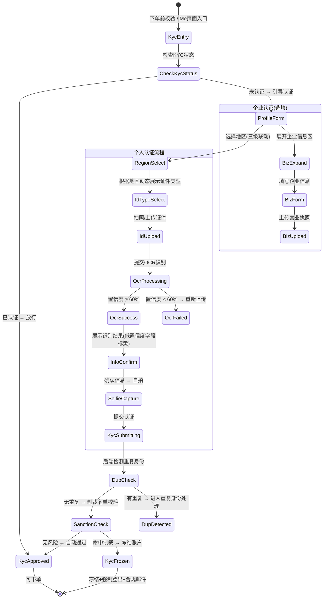

# 11-auth-kyc — APP KYC 认证

> **来源**: FoneSquare-PRD-v2.html · 身份认证/KYC模块
> **优先级**: P0 核心
> **最后更新**: 2026-05-07

---

## 1. 页面定位

用户个人实名认证（必填）与企业认证（选填）页面。全自动校验流程：OCR 识别证件 → 信息确认 → 制裁名单比对 → 自动通过/拒绝，无人工审核环节。KYC 通过后用户方可下单。

---

## 2. 状态机



---

## 3. 组件树

```
KycModule/
├── KycEntryBanner                   // Me页面KYC入口横幅
│   ├── VerificationIcon             // 🛡️图标
│   ├── StatusText                   // "Complete Identity Verification"
│   └── ChevronRight                 // 箭头
├── ProfilePage                      // 身份认证主页
│   ├── PageHeader                   // 导航栏(返回+标题)
│   ├── PersonalInfoSection          // 个人信息区
│   │   ├── RegionPicker             // 三级联动地区选择器
│   │   │   ├── BottomSheet          // 底部弹窗容器
│   │   │   ├── BreadcrumbNav        // 面包屑导航(国家→省份→城市)
│   │   │   ├── SearchFilter         // 搜索过滤输入框
│   │   │   └── OptionList           // 选项列表
│   │   ├── FullNameInput            // 姓名输入(单字段,OCR自动填入)
│   │   ├── IdTypePicker             // 证件类型选择器(按地区动态)
│   │   ├── IdPhotoUploader          // 证件照上传区
│   │   │   ├── FrontSide            // 正面上传框
│   │   │   ├── BackSide             // 背面上传框(身份证需要)
│   │   │   └── InfoPage             // 信息页(护照需要)
│   │   ├── OcrResultDisplay         // OCR识别结果展示
│   │   │   ├── FieldRow             // 字段行(正常/标黄)
│   │   │   └── ManualEditHint       // "可手动修正"提示
│   │   └── SelfieCapture            // 自拍组件
│   │       ├── CameraPreview        // 相机预览
│   │       └── FaceGuide            // 人脸引导框
│   ├── BusinessInfoSection          // 企业信息区(选填)
│   │   ├── ExpandToggle             // 展开/收起切钮
│   │   ├── IncentiveText            // "Complete business info to unlock higher purchase limits"
│   │   ├── CompanyNameInput         // 公司名称
│   │   ├── BusinessRegNoInput       // 商业登记号
│   │   └── LicensePhotoUploader     // 营业执照照片上传
│   ├── SubmitButton                 // "SUBMIT & CONTINUE"
│   └── SkipLink                     // "Skip for now →"
├── OcrLoadingOverlay                // OCR识别中加载层
├── KycResultPage                    // 认证结果页
│   ├── ApprovedState                // 通过状态(绿色badge)
│   └── RejectedState               // 拒绝状态(原因展示)
└── AccountFrozenPage                // 账号冻结页
    ├── FrozenIcon                   // 冻结图标
    ├── ReasonText                   // 冻结原因
    └── ContactSupport               // 联系客服按钮
```

---

## 4. 字段清单

### 4.1 个人认证（必填）

| 字段名 | 类型 | 必填 | 校验规则 | 说明 |
|--------|------|------|----------|------|
| country | string | 是 | 三级联动第一级，有效国家代码 | 如 HK/MO/CN/SG/US 等 |
| province | string | 是 | 三级联动第二级，有效省份/州ID | 如 Kowloon/New Territories |
| city | string | 是 | 三级联动第三级，有效城市/区名称 | 如 Kwun Tong |
| full_name | string | 是 | 1-100字符，支持中英文及特殊字符 | 统一单字段，不拆分First/Last；OCR识别结果自动填入，用户可编辑 |
| id_type | enum | 是 | 按地区动态校验（见下方对照表） | HK→hk_id/passport；MO→mo_id/passport；CN→cn_id/passport；其他→passport |
| id_number | string | 是 | 按证件类型正则校验 | 脱敏存储，仅后4位可查看 |
| id_photo_front | file | 是 | JPG/PNG，≤10MB | 证件正面照 |
| id_photo_back | file | 条件必填 | JPG/PNG，≤10MB | 身份证类需要背面；护照不需要 |
| id_photo_info | file | 条件必填 | JPG/PNG，≤10MB | 护照信息页 |
| selfie_photo | file | 是 | JPG/PNG，≤10MB | 自拍照，活体检测 |
| id_expiry_date | date | 否 | DATE格式(无时区)，不早于当前日期 | OCR识别自动提取，用户可编辑 |

### 4.2 多国证件类型对照

| 地区 | 区号 | 可选证件类型 | 证件号正则 |
|------|------|-------------|-----------|
| 香港 HK | +852 | 香港身份证(hk_id)、护照(passport) | hk_id: `^[A-Z]{1,2}[0-9]{6}\([0-9A]\)$`；passport: `^[A-Z0-9]{5,20}$` |
| 澳门 MO | +853 | 澳门身份证(mo_id)、护照(passport) | mo_id: `^[157][0-9]{6}\([0-9]\)$`；passport: 同上 |
| 中国大陆 CN | +86 | 居民身份证(cn_id)、护照(passport) | cn_id: `^[0-9]{17}[0-9X]$`(18位)；passport: 同上 |
| 其他地区 | — | 仅护照(passport) | passport: `^[A-Z0-9]{5,20}$` |

### 4.3 企业认证（选填，展开后必填）

| 字段名 | 类型 | 必填 | 校验规则 | 说明 |
|--------|------|------|----------|------|
| company_name | string | 展开后必填 | 1-200字符 | 公司全称 |
| business_reg_no | string | 展开后必填 | 1-50字符，字母+数字 | 商业登记号 |
| license_photo | file | 展开后必填 | JPG/PNG，≤10MB | 营业执照/商业登记证照片 |

### 4.4 OCR 识别结果

| 字段名 | 类型 | 说明 |
|--------|------|------|
| ocr_full_name | string | OCR识别出的姓名 |
| ocr_id_number | string | OCR识别出的证件号 |
| ocr_expiry_date | date | OCR识别出的有效期 |
| ocr_confidence | float | 整体置信度(0-100%) |
| field_confidences | object | 各字段独立置信度 |

---

## 5. 交互规则

| 编号 | 规则 |
|------|------|
| IR-001 | KYC入口仅两处：① 下单前校验未认证时引导 ② Me页面 Identity Verification Banner / Settings页入口 |
| IR-002 | 三级联动地区选择器在同一底部弹窗内，面包屑导航Tab(国家→省份→城市)，选择国家后自动推进到省份级 |
| IR-003 | 地区选择器支持关键词搜索和回退（点击面包屑可回到上级） |
| IR-004 | 证件类型根据所选国家/地区**动态展示**：切换地区时证件类型自动重置 |
| IR-005 | 证件照上传支持相机拍照和相册选择两种方式，图片上传前客户端压缩 |
| IR-006 | 上传证件后自动触发OCR识别，展示识别中加载层(≤8秒) |
| IR-007 | OCR识别结果中，置信度 < 85% 的字段**标黄高亮**，提示用户手动检查和修正 |
| IR-008 | OCR 整体置信度 < 60% 时自动拒绝，Toast提示"图片不清晰，请重新上传" |
| IR-009 | 企业信息区默认收起，展示引导文案 "Complete business info to unlock higher purchase limits" 鼓励展开填写 |
| IR-010 | 企业信息区展开后字段变为必填，收起则不提交企业信息 |
| IR-011 | "Skip for now" 链接仅在从Me页面进入时展示；下单前强制认证时**不展示跳过** |
| IR-012 | 认证通过后 Me 页面头像旁展示绿色 ✅ Verified badge |
| IR-013 | 认证拒绝时展示具体原因，用户最多可重新提交**3次**，超过需联系客服 |
| IR-014 | 制裁命中时展示账号冻结页面，无操作选项，仅"联系客服"按钮 |
| IR-015 | 三语支持：所有页面内容、表单标签、Toast提示、地区名称均支持 English/简体中文/繁體中文 |
| IR-016 | 姓名字段统一为 Full Name 单字段，不拆分 First/Last Name |

---

## 6. 业务规则

| 编号 | 规则 |
|------|------|
| BR-001 | **全自动校验**：KYC无人工审核环节，OCR+制裁名单校验通过即自动通过 |
| BR-002 | **OCR 服务**：调用第三方OCR API识别证件信息（候选：腾讯云OCR/阿里云eKYC/Azure Document Intelligence，待采购评估） |
| BR-003 | **OCR 置信度阈值**：整体 < 60% 自动拒绝要求重新上传；字段级 < 85% 标黄允许手动修正 |
| BR-004 | **制裁名单数据源**：OFAC SDN List、OFAC Consolidated、联合国安理会、欧盟制裁名单 |
| BR-005 | **制裁校验范围**：以OCR识别出的姓名(含别名) + 证件号 + 国籍进行全量比对 |
| BR-006 | **制裁命中处理**：自动冻结账户(`account_status`→frozen) + 强制登出所有会话 + 触发合规邮件通知运营 |
| BR-007 | **证件信息脱敏存储**：数据库中姓名和证件号加密存储，API返回时仅展示姓名+证件号后4位；admin/operator角色可查看原值 |
| BR-008 | **一人一号**：同一证件类型+证件号仅允许关联一个已认证账号（重复检测见12-auth-duplicate） |
| BR-009 | **证件照存储**：上传至对象存储(S3/OSS)，路径按 `kyc/{uid}/{timestamp}_{side}.jpg` 组织，设置访问权限为private |
| BR-010 | **重提限制**：认证被拒绝后最多可重新提交3次，超过需联系客服人工处理 |
| BR-011 | **企业认证可选**：企业信息为选填，但填写后可解锁更高购买限额 |
| BR-012 | **KYC状态枚举**：none(未提交) → pending(审核中/OCR处理中) → approved(通过) → rejected(拒绝) → frozen(冻结) |
| BR-013 | **证件有效期检查**：到期日当天 23:59:59(UTC+8) 后才算失效 |
| BR-014 | **KYC触发制裁校验时机**：仅在提交认证时触发，不做季度轮询校验（后台编辑认证信息时也触发） |
| BR-015 | **自拍要求**：用于活体检测，防止使用他人证件注册 |

---

## 7. 前端实现要点

### 7.1 路由

```
/kyc/profile               → ProfilePage (身份认证表单)
/kyc/ocr-loading           → OcrLoadingOverlay (OCR识别中)
/kyc/result                → KycResultPage (认证结果)
/kyc/frozen                → AccountFrozenPage (账号冻结)
```

### 7.2 状态管理

```typescript
interface KycState {
  kycStatus: 'none' | 'pending' | 'approved' | 'rejected' | 'frozen';
  retryCount: number;           // 重提次数(≤3)

  region: {
    country: string | null;     // 国家代码
    province: string | null;    // 省份ID
    city: string | null;        // 城市名
  };

  personalInfo: {
    fullName: string;
    idType: 'hk_id' | 'mo_id' | 'cn_id' | 'passport';
    idNumber: string;
    idExpiryDate: string | null;
    idPhotoFront: File | null;
    idPhotoBack: File | null;
    idPhotoInfo: File | null;
    selfiePhoto: File | null;
  };

  ocrResult: {
    fullName: string;
    idNumber: string;
    expiryDate: string;
    overallConfidence: number;
    fieldConfidences: Record<string, number>;
  } | null;

  businessInfo: {
    isExpanded: boolean;
    companyName: string;
    businessRegNo: string;
    licensePhoto: File | null;
  };

  entrySource: 'order_check' | 'my_center' | 'settings';
}
```

### 7.3 API 调用

| 接口 | 方法 | 路径 | 说明 |
|------|------|------|------|
| 获取KYC状态 | GET | `/api/v1/kyc/status` | → `{ kyc_status, retry_count, approved_at }` |
| 获取地区数据 | GET | `/api/v1/regions?parent_id={id}` | 三级联动数据接口 |
| 上传证件照 | POST | `/api/v1/kyc/upload` | multipart/form-data，返回 file_key |
| 触发OCR识别 | POST | `/api/v1/kyc/ocr` | body: `{ file_key, id_type }` → `{ ocr_result }` |
| 提交KYC认证 | POST | `/api/v1/kyc/submit` | body: 完整表单数据 → `{ result: 'approved' \| 'rejected' \| 'duplicate' \| 'frozen', detail }` |
| 获取认证结果 | GET | `/api/v1/kyc/result` | → `{ status, reason, approved_at }` |

---

## 8. 后端实现要点

### 8.1 校验逻辑

- **图片校验**: 检查MIME类型(仅JPG/PNG)、文件大小(≤10MB)、图片尺寸(最小300x300px)
- **OCR 置信度判定**: `confidence < 0.60` → 自动拒绝返回错误；`0.60 ≤ confidence < 0.85` → 标黄字段；`confidence ≥ 0.85` → 正常通过
- **证件号格式**: 按 id_type 选择对应正则校验
- **重复身份检测**: `SELECT * FROM kyc_records WHERE id_type = ? AND id_number_hash = ? AND kyc_status = 'approved' AND uid != ?`
- **制裁名单校验**: 调用风控API，传入 `{ name, id_number, nationality, aliases }` → `{ hit: boolean, matches: [] }`

### 8.2 数据库操作

```sql
-- KYC认证记录表
CREATE TABLE kyc_records (
    id              BIGINT PRIMARY KEY AUTO_INCREMENT,
    uid             BIGINT NOT NULL,
    kyc_status      ENUM('pending','approved','rejected','frozen') NOT NULL,
    retry_count     TINYINT DEFAULT 0,

    -- 地区信息
    country_code    VARCHAR(10) NOT NULL,
    province_id     VARCHAR(50),
    city_name       VARCHAR(100),

    -- 个人信息(加密存储)
    full_name_enc   VARBINARY(500) NOT NULL,   -- AES加密
    id_type         ENUM('hk_id','mo_id','cn_id','passport') NOT NULL,
    id_number_enc   VARBINARY(500) NOT NULL,   -- AES加密
    id_number_hash  VARCHAR(64) NOT NULL,       -- SHA256哈希(用于去重查询)
    id_number_last4 VARCHAR(4) NOT NULL,        -- 后4位明文(列表展示用)
    id_expiry_date  DATE,

    -- 证件照存储路径
    photo_front_key VARCHAR(500),
    photo_back_key  VARCHAR(500),
    photo_info_key  VARCHAR(500),
    selfie_key      VARCHAR(500),

    -- OCR结果
    ocr_confidence  DECIMAL(5,2),
    ocr_raw_result  JSON,

    -- 企业信息(选填)
    company_name    VARCHAR(200),
    biz_reg_no      VARCHAR(50),
    license_key     VARCHAR(500),

    -- 制裁校验
    sanction_checked BOOLEAN DEFAULT FALSE,
    sanction_hit     BOOLEAN DEFAULT FALSE,
    sanction_detail  JSON,

    -- 审核
    reject_reason   VARCHAR(500),
    approved_at     TIMESTAMP NULL,
    created_at      TIMESTAMP DEFAULT CURRENT_TIMESTAMP,
    updated_at      TIMESTAMP DEFAULT CURRENT_TIMESTAMP ON UPDATE CURRENT_TIMESTAMP,

    FOREIGN KEY (uid) REFERENCES users(uid),
    INDEX idx_id_hash (id_type, id_number_hash),
    INDEX idx_uid_status (uid, kyc_status)
);

-- 地区数据表(三级联动)
CREATE TABLE regions (
    id          INT PRIMARY KEY AUTO_INCREMENT,
    parent_id   INT DEFAULT 0,
    level       TINYINT NOT NULL,           -- 1=国家, 2=省份, 3=城市
    code        VARCHAR(20) NOT NULL,
    name_en     VARCHAR(100) NOT NULL,
    name_zh_hans VARCHAR(100),
    name_zh_hant VARCHAR(100),
    sort_order  INT DEFAULT 0,
    INDEX idx_parent (parent_id)
);
```

### 8.3 事件触发

| 事件 | 触发时机 | 动作 |
|------|----------|------|
| `kyc.submitted` | 用户提交KYC | 创建 kyc_records 记录(pending) → 调用OCR → 检测重复 → 制裁校验 |
| `kyc.ocr_completed` | OCR识别完成 | 更新 ocr_confidence 和 ocr_raw_result |
| `kyc.approved` | 校验全部通过 | 更新 kyc_status=approved、users.kyc_status=approved |
| `kyc.rejected` | 校验拒绝 | 更新 kyc_status=rejected、记录 reject_reason、retry_count++ |
| `kyc.sanction_hit` | 制裁名单命中 | 更新 kyc_status=frozen、users.account_status=frozen → 清除所有会话 → 发送合规邮件给运营 |
| `kyc.duplicate_detected` | 重复身份检测命中 | 返回已有账号脱敏信息，进入重复身份处理流程(见12-auth-duplicate) |
| `kyc.retry_exceeded` | 重提超过3次 | 锁定KYC提交入口，提示联系客服 |

### 8.4 性能要求

| 指标 | 目标值 |
|------|--------|
| OCR 识别延迟 | ≤ 8秒 |
| 制裁名单校验延迟 | ≤ 3秒 |
| 图片上传(10MB) | ≤ 5秒 |

### 8.5 安全要求

- 证件信息使用 AES-256-GCM 加密存储，密钥由 KMS 管理
- 证件照文件存储在私有桶，通过预签名URL(有效期5分钟)访问
- API 访问证件原值需 admin/operator 角色权限校验
- OCR 原始结果仅后端存储，不返回给前端
