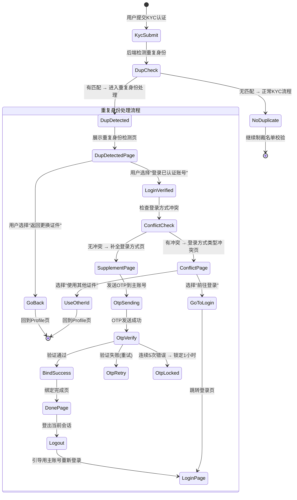

# 12-auth-duplicate — 重复身份处理

> **来源**: FoneSquare-PRD-v2.html · KYC重复身份处理（方案C）
> **优先级**: P0 核心
> **最后更新**: 2026-05-07

---

## 1. 页面定位

KYC 提交时系统检测到同一证件已关联其他已认证账号，引导用户登录已认证账号并补全登录方式，当前未认证账号自动废弃。**核心思路：不做账号合并，不做数据迁移。**

---

## 2. 状态机



---

## 3. 组件树

```
DuplicateIdentityModule/
├── DupDetectedPage                    // KD1: 重复身份检测页
│   ├── PageHeader                     // 导航栏(返回+标题)
│   ├── WarningIcon                    // ⚠️ 警告图标
│   ├── TitleText                      // "Identity Already Verified"
│   ├── DescriptionText                // 说明文案(含脱敏手机号/邮箱)
│   ├── VerifiedAccountCard            // 已认证账号信息卡片
│   │   ├── AccountAvatar              // 头像
│   │   ├── MaskedPhone                // 脱敏手机号(+852****1234)
│   │   ├── MaskedEmail                // 脱敏邮箱(j***@gmail.com)
│   │   └── VerifiedBadge              // ✅ Verified标识
│   ├── LoginVerifiedButton            // "LOG IN TO VERIFIED ACCOUNT" 主按钮
│   └── GoBackLink                     // "← Use a different ID / 返回更换证件"
│
├── SupplementPage                     // KD2: 补全登录信息页
│   ├── PageHeader
│   ├── InfoText                       // "将当前登录方式添加到已认证账号"
│   ├── CurrentMethodDisplay           // 当前登录方式展示
│   │   ├── MethodType                 // 类型标签(Email/Phone/WhatsApp)
│   │   └── MethodValue                // 值(脱敏展示)
│   ├── TargetAccountDisplay           // 目标账号展示
│   │   └── MaskedInfo                 // 脱敏信息
│   └── VerifyAndLinkButton            // "VERIFY & LINK" 按钮
│
├── DupOtpVerifyPage                   // KD3: 二次OTP验证页
│   ├── PageHeader
│   ├── SendTargetInfo                 // OTP发送目标提示(主账号手机/邮箱)
│   ├── OtpCodeInput[6]               // 6位验证码输入
│   ├── CountdownTimer                 // 60s重发倒计时
│   ├── ResendButton                   // 重新发送
│   └── VerifyButton                   // 验证按钮
│
├── DupDonePage                        // KD4: 迁移完成页
│   ├── SuccessIcon                    // ✅ 成功图标
│   ├── TitleText                      // "Account Linked Successfully"
│   ├── DescriptionText                // "此账号将不再使用，请使用已认证账号登录"
│   ├── LinkedAccountInfo              // 已认证账号信息
│   └── ContinueButton                // "CONTINUE" → 登出并跳转登录页
│
└── ConflictPage                       // 登录方式类型冲突页
    ├── PageHeader
    ├── WarningIcon
    ├── ConflictDescription            // "已认证账号已有相同类型的登录方式"
    ├── ConflictDetail                 // 冲突详情
    ├── GoToLoginButton                // "Go to Login / 前往登录"
    └── UseOtherIdLink                 // "Use a different ID / 使用其他证件"
```

---

## 4. 字段清单

### 4.1 重复身份检测请求/响应

| 字段名 | 类型 | 必填 | 校验规则 | 说明 |
|--------|------|------|----------|------|
| id_type | enum | 是 | hk_id/mo_id/cn_id/passport | 证件类型 |
| id_number_hash | string | 是 | SHA256哈希 | 证件号哈希，用于匹配 |
| current_uid | bigint | 是 | 当前登录用户UID | 排除自身 |

### 4.2 检测结果（后端返回）

| 字段名 | 类型 | 说明 |
|--------|------|------|
| is_duplicate | boolean | 是否检测到重复 |
| verified_account | object | 已认证账号信息(脱敏) |
| verified_account.uid | bigint | 主账号UID（不传给前端） |
| verified_account.phone_masked | string | 脱敏手机号：+852****1234 |
| verified_account.email_masked | string | 脱敏邮箱：j***@gmail.com |
| verified_account.has_phone | boolean | 是否已有手机号 |
| verified_account.has_email | boolean | 是否已有邮箱 |
| verified_account.has_whatsapp | boolean | 是否已有WhatsApp |
| verified_account.account_status | string | 账号状态(active/frozen) |

### 4.3 补全登录方式

| 字段名 | 类型 | 必填 | 校验规则 | 说明 |
|--------|------|------|----------|------|
| supplement_type | enum | 是 | email/phone/whatsapp | 要补全的登录方式类型 |
| supplement_value | string | 是 | 同登录注册对应校验 | 要补全的值(当前账号使用的登录方式) |
| duplicate_token | string | 是 | 服务端签发的临时token | 重复身份处理流程的临时授权 |

### 4.4 二次OTP验证

| 字段名 | 类型 | 必填 | 校验规则 | 说明 |
|--------|------|------|----------|------|
| otp_code | string | 是 | 6位纯数字 | 发送到主账号的验证码 |
| duplicate_token | string | 是 | 有效的临时token | 关联此次重复身份处理 |

---

## 5. 交互规则

| 编号 | 规则 |
|------|------|
| IR-001 | 重复身份检测页展示已认证账号的**脱敏信息**：手机号显示 `+852****1234`，邮箱显示 `j***@gmail.com` |
| IR-002 | 主按钮 "LOG IN TO VERIFIED ACCOUNT" 使用品牌红色(#E53935)；"返回更换证件" 使用灰色文字链接 |
| IR-003 | 文案**避免使用"废弃/删除"等负面表达**，使用"此账号将不再使用"、"Your account will be deactivated" 等友好措辞 |
| IR-004 | OTP 发送目标为主账号，**优先级**：手机号 > WhatsApp > 邮箱 |
| IR-005 | OTP 验证页展示 "验证码已发送至 +852****1234" 提示（脱敏展示） |
| IR-006 | OTP 验证通过后自动执行绑定操作，展示绑定中加载态 |
| IR-007 | 绑定完成页的 "CONTINUE" 按钮点击后：① 登出当前会话 ② 跳转到登录页 ③ Toast提示"请使用已认证账号登录" |
| IR-008 | **不自动切换登录态**：操作成功后必须登出当前会话，用户需手动用主账号登录 |
| IR-009 | 登录方式类型冲突时（如已认证账号已有邮箱，当前也是邮箱登录），展示冲突页面而非补全页面 |
| IR-010 | 冲突页提供两个选项："前往登录"(跳转登录页) 和 "使用其他证件"(回到Profile页) |
| IR-011 | 如果主账号被冻结(frozen)，检测页展示"该关联账号状态异常，无法操作"，隐藏登录按钮，仅展示"联系客服"和"返回" |

---

## 6. 业务规则

| 编号 | 规则 |
|------|------|
| BR-001 | **检测时机**：仅在用户提交KYC认证时触发，以 `证件类型 + 证件号` 为联合键查询 |
| BR-002 | **匹配范围**：仅匹配 KYC 状态为 `approved`(已通过) 的账号；`rejected`/`pending` 不参与匹配 |
| BR-003 | **主账号判定**：以**最早完成KYC认证**的账号为主账号 |
| BR-004 | **多账号匹配**：同一证件匹配到 2+ 个已认证账号时，仅展示最早完成KYC的主账号 |
| BR-005 | **冻结账号不可绑定**：主账号 `account_status=frozen` 时，不允许绑定，提示联系客服 |
| BR-006 | **OTP 二次验证**：必须通过OTP验证主账号身份，防止证件盗用攻击 |
| BR-007 | **OTP 发送优先级**：主账号手机号 > WhatsApp > 邮箱。如主账号无任何联系方式（极端情况），提示联系客服 |
| BR-008 | **OTP 错误锁定**：连续验证错误5次，锁定1小时（与登录OTP规则一致） |
| BR-009 | **绑定原子性**：绑定操作在数据库事务中完成 → 中断时保持原状，下次提交KYC重新触发 |
| BR-010 | **绑定后效果**：当前登录方式绑定到主账号，主账号可使用任意已绑定方式登录 |
| BR-011 | **密码处理**：各登录方式保留各自的密码（不做密码迁移） |
| BR-012 | **未认证账号处理**：标记为 `deactivated`，该账号的登录方式解绑，用户无法再用该账号登录 |
| BR-013 | **已停用账号登录**：用户尝试用已停用账号的原登录方式登录时，如该方式已绑定到主账号则正常登录主账号；如未绑定，提示"该账号已停用" |
| BR-014 | **登录方式冲突**：已认证账号已有相同类型(email/phone/whatsapp)的登录方式时，无法补全，展示冲突页 |
| BR-015 | **操作日志**：所有重复身份处理操作写入 `kyc_dup_logs` 表，记录完整操作链路 |
| BR-016 | **证件盗用防护**：OTP验证机制确保只有能收到主账号验证码的人才能完成绑定 |

---

## 7. 前端实现要点

### 7.1 路由

```
/kyc/duplicate/detected       → DupDetectedPage (KD1)
/kyc/duplicate/supplement     → SupplementPage (KD2)
/kyc/duplicate/otp-verify     → DupOtpVerifyPage (KD3)
/kyc/duplicate/done           → DupDonePage (KD4)
/kyc/duplicate/conflict       → ConflictPage (登录方式冲突)
```

### 7.2 状态管理

```typescript
interface DuplicateState {
  isDuplicate: boolean;
  duplicateToken: string | null;       // 服务端签发的临时token

  verifiedAccount: {
    phoneMasked: string | null;        // +852****1234
    emailMasked: string | null;        // j***@gmail.com
    hasPhone: boolean;
    hasEmail: boolean;
    hasWhatsapp: boolean;
    accountStatus: 'active' | 'frozen';
  } | null;

  currentMethod: {
    type: 'phone' | 'email' | 'whatsapp';
    value: string;                      // 当前账号使用的登录方式值
  };

  hasConflict: boolean;                 // 登录方式类型冲突
  conflictType: string | null;          // email/phone/whatsapp

  otpSentTo: string;                    // OTP发送目标(脱敏)
  otpAttempts: number;
  isLocked: boolean;

  step: 'detected' | 'supplement' | 'otp_verify' | 'binding' | 'done' | 'conflict';
}
```

### 7.3 API 调用

| 接口 | 方法 | 路径 | 说明 |
|------|------|------|------|
| 重复身份检测 | — | — | 集成在 `/api/v1/kyc/submit` 响应中，`result: 'duplicate'` 时返回已有账号信息 |
| 发起绑定(发送OTP) | POST | `/api/v1/kyc/duplicate/initiate` | body: `{ duplicate_token, supplement_type, supplement_value }` → `{ otp_sent_to_masked }` |
| 验证OTP并绑定 | POST | `/api/v1/kyc/duplicate/verify` | body: `{ duplicate_token, otp_code }` → `{ success, message }` |
| 检查登录方式冲突 | POST | `/api/v1/kyc/duplicate/check-conflict` | body: `{ duplicate_token, supplement_type }` → `{ has_conflict, conflict_detail }` |

### 7.4 流程串联

```
KYC提交 → POST /api/v1/kyc/submit
  ├── result: 'approved'    → 跳转认证结果页 ✅
  ├── result: 'rejected'    → 跳转认证结果页 ❌
  ├── result: 'frozen'      → 跳转冻结页 🔒
  └── result: 'duplicate'   → 存储 duplicateToken + verifiedAccount
      → 检查冲突 POST /check-conflict
        ├── 无冲突 → 跳转 /kyc/duplicate/detected (KD1)
        │   → 用户点击"登录已认证账号"
        │   → 跳转 /kyc/duplicate/supplement (KD2)
        │   → 点击"VERIFY & LINK"
        │   → POST /initiate (发送OTP)
        │   → 跳转 /kyc/duplicate/otp-verify (KD3)
        │   → POST /verify (验证OTP+绑定)
        │   → 跳转 /kyc/duplicate/done (KD4)
        │   → 点击"CONTINUE" → 登出 → 跳转 /login
        └── 有冲突 → 跳转 /kyc/duplicate/conflict
```

---

## 8. 后端实现要点

### 8.1 校验逻辑

- **重复检测查询**: `SELECT uid, kyc_status, approved_at FROM kyc_records WHERE id_type = ? AND id_number_hash = ? AND kyc_status = 'approved' AND uid != ? ORDER BY approved_at ASC LIMIT 1`
- **冲突检测**: `SELECT method_type FROM user_login_methods WHERE uid = ? AND method_type = ?` — 检查主账号是否已有相同类型登录方式
- **duplicate_token**: JWT格式，payload包含 `{ current_uid, verified_uid, id_type, id_number_hash, expires_at }`，有效期30分钟
- **OTP 二次验证**: 复用现有OTP逻辑，但发送目标为主账号

### 8.2 数据库操作

```sql
-- 重复身份处理日志表
CREATE TABLE kyc_dup_logs (
    id                BIGINT PRIMARY KEY AUTO_INCREMENT,
    current_uid       BIGINT NOT NULL,         -- 当前未认证账号UID
    verified_uid      BIGINT NOT NULL,          -- 已认证账号UID(主账号)
    id_type           VARCHAR(20) NOT NULL,
    id_number_hash    VARCHAR(64) NOT NULL,
    action            ENUM('detected','supplement_initiated','otp_sent','otp_verified','bind_success','bind_failed','conflict','go_back') NOT NULL,
    supplement_type   VARCHAR(20),              -- email/phone/whatsapp
    supplement_value  VARCHAR(200),             -- 加密存储
    ip_address        VARCHAR(50),
    user_agent        TEXT,
    created_at        TIMESTAMP DEFAULT CURRENT_TIMESTAMP,
    FOREIGN KEY (current_uid) REFERENCES users(uid),
    FOREIGN KEY (verified_uid) REFERENCES users(uid),
    INDEX idx_current (current_uid),
    INDEX idx_verified (verified_uid)
);
```

### 8.3 绑定操作（事务）

```sql
BEGIN TRANSACTION;

-- 1. 将当前登录方式绑定到主账号
INSERT INTO user_login_methods (uid, method_type, identifier, country_code, password_hash, is_primary)
VALUES (@verified_uid, @supplement_type, @supplement_value, @country_code, @password_hash, FALSE);

-- 2. 从当前账号解绑该登录方式
DELETE FROM user_login_methods WHERE uid = @current_uid AND method_type = @supplement_type AND identifier = @supplement_value;

-- 3. 停用当前账号
UPDATE users SET account_status = 'deactivated', updated_at = NOW() WHERE uid = @current_uid;

-- 4. 清除当前账号所有会话
DELETE FROM user_sessions WHERE uid = @current_uid;

-- 5. 写入操作日志
INSERT INTO kyc_dup_logs (current_uid, verified_uid, id_type, id_number_hash, action, supplement_type, supplement_value, ip_address)
VALUES (@current_uid, @verified_uid, @id_type, @id_number_hash, 'bind_success', @supplement_type, @supplement_value_enc, @ip);

COMMIT;
```

### 8.4 事件触发

| 事件 | 触发时机 | 动作 |
|------|----------|------|
| `kyc.duplicate_detected` | 检测到重复身份 | 签发 duplicate_token、写入 kyc_dup_logs(action=detected)、返回脱敏信息 |
| `kyc.dup_otp_sent` | OTP发送到主账号 | 写入 otp_logs + kyc_dup_logs(action=otp_sent) |
| `kyc.dup_bind_success` | 绑定成功 | 事务执行上述SQL、写入 kyc_dup_logs(action=bind_success) |
| `kyc.dup_bind_failed` | 绑定失败(OTP错误等) | 写入 kyc_dup_logs(action=bind_failed) |
| `kyc.dup_conflict` | 检测到登录方式冲突 | 写入 kyc_dup_logs(action=conflict) |
| `kyc.dup_go_back` | 用户选择返回更换证件 | 写入 kyc_dup_logs(action=go_back) |

### 8.5 边界场景处理

| 场景 | 处理 |
|------|------|
| 同一证件匹配到 2+ 个已认证账号 | 取 `approved_at` 最早的作为主账号 |
| 主账号被冻结(frozen) | 前端展示"无法操作"提示，隐藏登录按钮 |
| OTP连续错误5次 | 锁定1小时，提示联系客服 |
| 主账号无手机号 | OTP发送到主账号邮箱（手机 > WhatsApp > 邮箱） |
| 绑定过程网络中断 | 事务回滚，保持原状，下次提交KYC重新触发 |
| 用户用已停用账号登录 | 提示"该账号已停用"，引导使用主账号 |
| 证件被盗用(攻击者上传他人证件) | OTP验证拦截——攻击者无法收到主账号验证码 |
| duplicate_token过期(30分钟) | 提示"操作超时，请重新提交认证" |

### 8.6 埋点关键事件

`kyc_dup_detected_view` → `kyc_dup_login_btn` → `kyc_dup_supplement_submit` → `kyc_dup_otp_verify` → `kyc_dup_done_continue`
