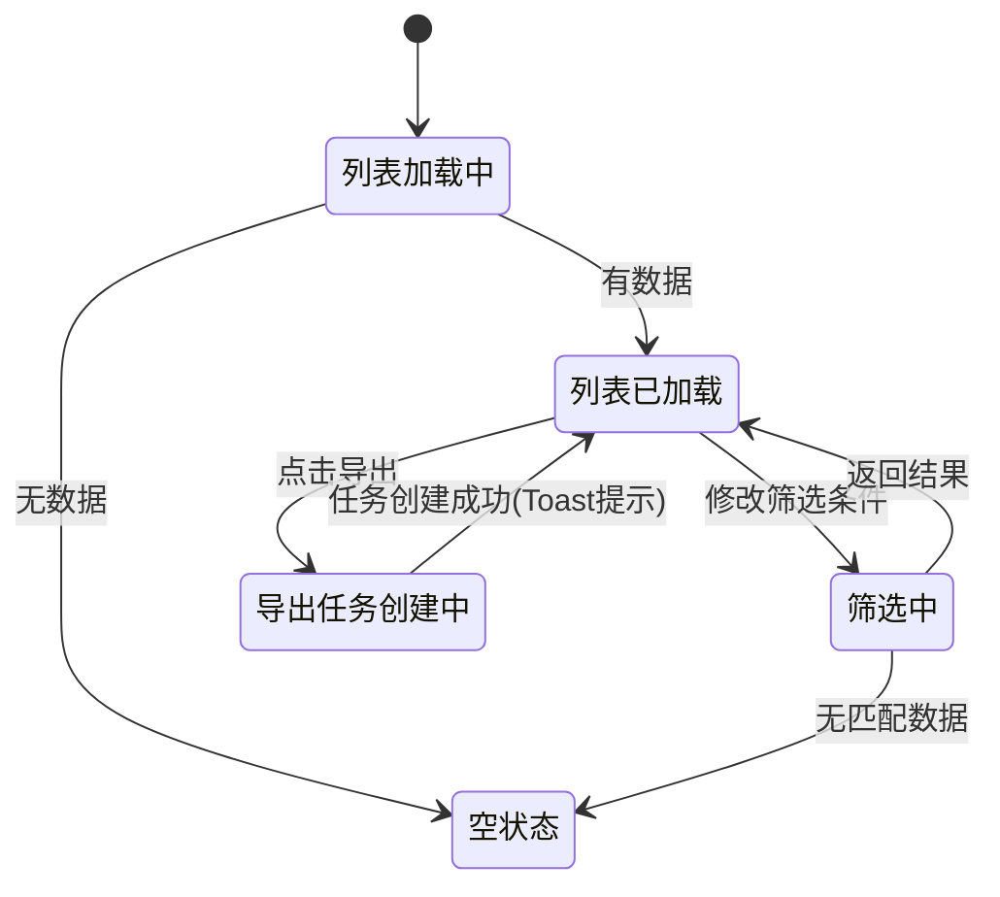

# 20-merchant-list — 商家列表

> 来源：FoneSquare PRD v1.0 · Web 商家管理后台

---

## 1. 页面定位

登录后默认首页，承载商家全生命周期管理的入口：多条件筛选、分页浏览、批量导出、添加商家入口，并按角色实施数据权限隔离（admin 全量 / advisor 仅自己维护的商家）。

---

## 2. 状态机

本页无独立状态机。商家状态流转见 `21-merchant-detail.md`。

以下为列表页视图状态：



---

## 3. 组件树

```
MerchantListPage
├── PageHeader（面包屑：首页 / 商家管理 / 商家列表）
├── FilterBar（筛选栏）
│   ├── InputSearch（商家名称 — 模糊搜索）
│   ├── Select（商家类型：全部/买家/卖家）
│   ├── Select（商家状态：全部/使用/停用）
│   ├── Select（认证状态：全部/已认证/未认证/账号受限）
│   ├── Select（维护人 — 仅 admin 可见，advisor 隐藏）
│   ├── Button（查询）
│   └── Button（重置）
├── ActionBar（操作栏）
│   ├── Button.Primary（➕ 添加商家）
│   └── Button（📥 导出）
├── MerchantTable（数据表格）
│   ├── Column（商家名称）
│   ├── Column（商家类型 — Tag）
│   ├── Column（所在地区）
│   ├── Column（认证状态 — Tag/Badge）
│   ├── Column（商家状态 — Tag）
│   ├── Column（维护人 — 姓名(工号)）
│   ├── Column（创建时间）
│   └── Column（操作）
│       ├── Link（查看 → 跳转详情）
│       └── Button（停用/启用 — admin/operator 可见，advisor 不可见）
├── Pagination（分页器：10/20/50 条/页）
└── EmptyState（空状态占位）
```

---

## 4. 字段清单

### 4.1 筛选条件

| 字段名 | 类型 | 必填 | 校验规则 | 说明 |
|--------|------|------|----------|------|
| merchant_name | String | 否 | 模糊匹配，≤100 字符 | 商家名称关键词搜索 |
| merchant_type | Enum | 否 | 全部 / buyer / seller | 商家类型筛选 |
| status | Enum | 否 | 全部 / active / disabled | 商家状态筛选 |
| kyc_status | Enum | 否 | 全部 / verified / unverified / restricted | 认证状态筛选 |
| advisor_id | String | 否 | OB 账号 ID | 维护人筛选（仅 admin 可见） |

### 4.2 列表列

| 字段名 | 类型 | 排序 | 说明 |
|--------|------|------|------|
| merchant_id | String | 默认倒序，支持查询 | 系统自动生成，非自增 |
| merchant_name | String | 支持模糊查询 | KYC 认证姓名，未认证为空 |
| merchant_type | Enum[] | — | 买家 / 卖家，可多选 Tag 展示 |
| region | String | — | 三级联动：国家/省/市 |
| kyc_status | Enum | — | 已认证 / 未认证 / 账号受限 |
| status | Enum | — | 使用 / 停用 |
| advisor | String | — | 维护人姓名(工号)，未分配显示 "未分配" |
| created_at | DateTime | 默认倒序 | 格式：YYYY-MM-DD HH:mm（UTC+8） |

---

## 5. 交互规则

| 编号 | 规则 |
|------|------|
| IR-001 | 页面加载时按创建时间倒序展示，默认每页 10 条 |
| IR-002 | 筛选条件变更后需点击「查询」按钮触发请求，非实时搜索 |
| IR-003 | 「重置」按钮清空所有筛选条件并重新加载默认列表 |
| IR-004 | 分页切换支持 10 / 20 / 50 条/页，切换后保持当前筛选条件 |
| IR-005 | 「查看」链接点击后路由跳转至商家详情页 `/:merchantId` |
| IR-006 | 「停用/启用」按钮点击弹出二次确认弹窗：停用确认文案 "确认停用该商家？停用后商家无法登录和下单"；启用确认文案 "确认启用该商家？" |
| IR-007 | 「添加商家」按钮点击后路由跳转至添加商家页面 |
| IR-008 | 「导出」按钮点击后创建异步导出任务，Toast 提示 "导出任务已创建，请到下载中心查看"，导出内容受当前筛选条件限制 |
| IR-009 | advisor 角色下，「维护人」筛选下拉框隐藏，列表自动按当前登录人过滤 |
| IR-010 | advisor 角色下，操作列不展示「停用/启用」按钮 |
| IR-011 | 列表为空时展示空状态插图 + 文案 "暂无商家数据" |
| IR-012 | 商家名称列过长时截断并 Tooltip 展示全文 |

---

## 6. 业务规则

| 编号 | 规则 |
|------|------|
| BR-001 | admin 拥有「全量海外数据」权限，可见所有海外商家 |
| BR-002 | advisor（销售/维护人）拥有「仅自己维护的商家」数据权限，列表仅展示已绑定到自己的商家 |
| BR-003 | "未分配"维护人的商家仅对 admin 可见，advisor 不可见 |
| BR-004 | 停用/启用操作需具备「停用/启用商家」功能权限点（admin/operator 默认拥有，advisor 无此权限） |
| BR-005 | 导出操作需具备「导出商家列表」功能权限点 |
| BR-006 | advisor 导出时数据受数据权限限制，仅导出自己维护的商家 |
| BR-007 | 导出为异步任务，生成 Excel 文件后存入下载中心，文件保留 7 天 |
| BR-008 | 认证状态枚举：`unverified`（未认证）/ `verified`（已认证）/ `restricted`（账号受限，命中制裁名单） |
| BR-009 | 商家状态枚举：`active`（使用）/ `disabled`（停用） |
| BR-010 | 商家类型支持同时为买家和卖家（多选），筛选时按单选过滤 |

---

## 7. 前端实现要点

### 路由
```
/merchant/list          — 商家列表（默认首页）
/merchant/:id           — 商家详情
/merchant/add           — 添加商家
/download-center        — 下载中心
```

### 状态管理
- **筛选状态**：URL query params 持久化（`?name=xxx&type=buyer&status=active&page=1&size=10`），支持浏览器回退保留筛选
- **列表数据**：请求级缓存，筛选/翻页时重新请求
- **角色信息**：从全局 Auth Store 读取当前用户角色和数据权限值
- **导出状态**：导出按钮点击后短暂 loading，创建任务后恢复

### API 调用
| 接口 | 方法 | 说明 |
|------|------|------|
| `GET /api/merchants` | GET | 列表查询，支持 query params：name, type, status, kyc_status, advisor_id, page, size, sort |
| `PATCH /api/merchants/:id/status` | PATCH | 停用/启用商家 `{ status: "active" | "disabled" }` |
| `POST /api/merchants/export` | POST | 创建导出任务，body 为当前筛选条件 |
| `GET /api/advisors` | GET | 获取维护人下拉列表（仅 admin 调用） |

---

## 8. 后端实现要点

### 校验逻辑
- 列表查询：根据请求方的数据权限值过滤数据（`全量海外数据` → 无额外 WHERE；`仅自己维护的商家` → `WHERE advisor_id = :currentUserId`）
- 停用/启用：校验操作人具备「停用/启用商家」功能权限 **且** 目标商家在操作人数据权限范围内
- 导出：校验操作人具备「导出商家列表」功能权限

### 数据库操作
- 列表查询：`SELECT` + 动态 WHERE + 分页 `LIMIT/OFFSET` + `ORDER BY created_at DESC`
- 维护人筛选：需 JOIN advisor 表获取姓名和工号
- 停用/启用：`UPDATE merchant SET status = :newStatus, updated_at = NOW() WHERE id = :id`
- 导出：将筛选条件 + 操作人信息写入 `export_task` 表，由异步 Worker 消费

### 事件触发
- 停用/启用操作成功后写入 `operation_log` 表（操作人、操作时间、变更前后状态值）
- 导出任务创建后发送消息到消息队列，Worker 拉取并生成 Excel
- Excel 生成完成后更新 `export_task.status = 'ready'`，文件上传至 OSS
- 7 天后定时任务标记过期 `export_task.status = 'expired'`
