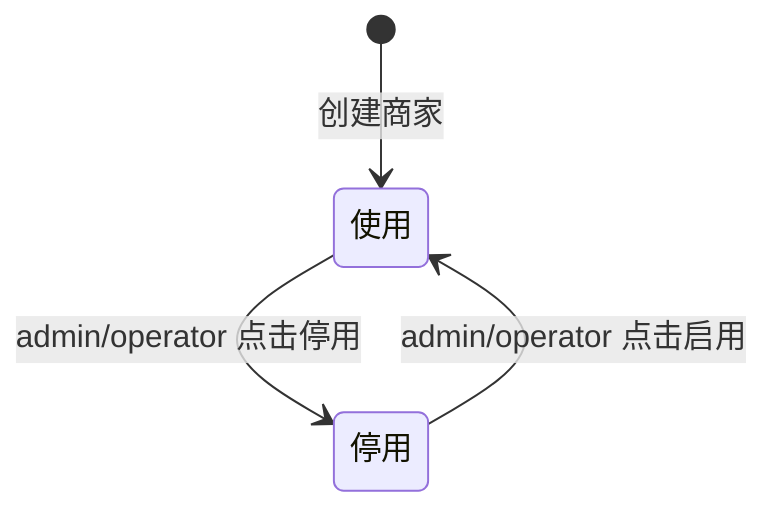
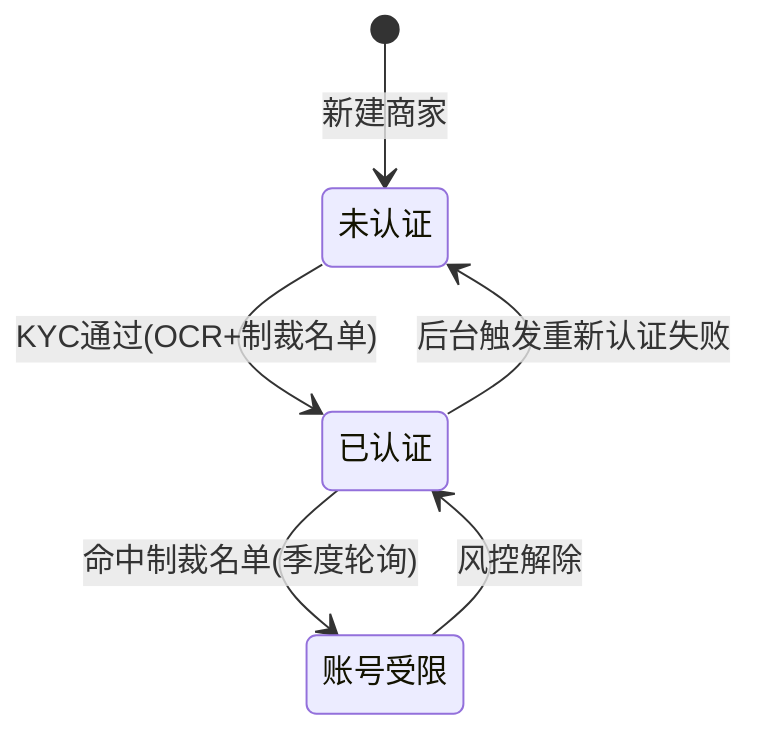
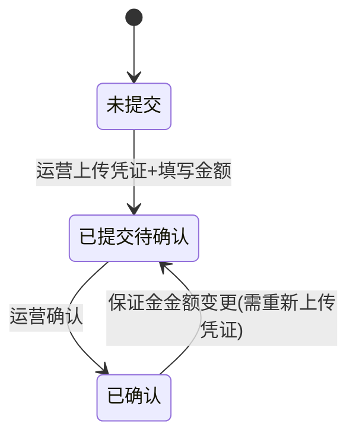

# 21-merchant-detail — 商家详情（5 Tab）

> 来源：FoneSquare PRD v1.0 · Web 商家管理后台

---

## 1. 页面定位

从商家列表点击「查看」进入，展示单个商家的完整信息。采用 5 个 Tab 页签组织——基本信息、KYC 认证材料、限额与保证金（仅买家）、维护人绑定、操作日志。admin 可执行全部写操作，advisor 仅只读且只能看到自己维护的商家。

---

## 2. 状态机

### 商家状态



### 认证状态



### 保证金状态



---

## 3. 组件树

```
MerchantDetailPage
├── PageHeader（面包屑：首页 / 商家管理 / 商家列表 / 商家详情）
├── DetailHeader（头部区域）
│   ├── MerchantName（商家名称）
│   ├── Tag（商家类型：买家/卖家）
│   ├── StatusBadge（商家状态：使用/停用）
│   └── Button（停用/启用 — 需权限，advisor 不可见）
├── TabContainer（5 Tab 页签）
│   ├── Tab1_BasicInfo（基本信息）
│   │   ├── FormItem（商家名称 — 只读/可编辑）
│   │   ├── FormItem（手机号 — 含区号）
│   │   ├── FormItem（邮箱）
│   │   ├── FormItem（WhatsApp）
│   │   ├── RegionCascader（所在地区 — 三级联动）
│   │   ├── FormItem.TextArea（备注）
│   │   └── Button（保存 — admin/operator 可见）
│   ├── Tab2_KYC（KYC 认证材料）
│   │   ├── Section（个人 KYC）
│   │   │   ├── FormItem（证件类型）
│   │   │   ├── FormItem（证件号 — 脱敏，可点击查看原值）
│   │   │   ├── FormItem（姓名 — 脱敏）
│   │   │   ├── FormItem（证件有效期）
│   │   │   └── ImageGroup（证件照：正面/背面/自拍 — 缩略图可放大）
│   │   ├── Section（企业 KYC — 选填区域）
│   │   │   ├── FormItem（企业名称）
│   │   │   ├── FormItem（证照类型）
│   │   │   ├── FormItem（证照编号）
│   │   │   ├── FormItem（法定代表/董事）
│   │   │   ├── FormItem（企业地址）
│   │   │   ├── FormItem（证照有效期）
│   │   │   └── ImageGroup（证照照片 — 缩略图可放大）
│   │   └── Button（编辑 KYC — admin/operator 可见）
│   ├── Tab3_QuotaDeposit（限额与保证金 — 仅买家展示）
│   │   ├── Section（限额配置）
│   │   │   ├── InputNumber（每日下单限额 HKD）
│   │   │   └── Hint（上限 = 保证金 × 10）
│   │   ├── Section（保证金管理）
│   │   │   ├── InputNumber（保证金金额 HKD）
│   │   │   ├── ImageUpload（转账凭证 — 最多3张 JPG/PNG ≤5MB）
│   │   │   ├── StatusTag（保证金状态）
│   │   │   ├── Text（确认时间 / 确认人）
│   │   │   └── Button（确认保证金 — admin/operator）
│   │   └── Button（校验并保存 — admin/operator 可见）
│   ├── Tab4_Advisor（维护人绑定）
│   │   ├── Section（当前维护人）
│   │   │   ├── Text（姓名）
│   │   │   ├── Text（OB 账号）
│   │   │   ├── Text（绑定时间）
│   │   │   └── Text（操作人）
│   │   ├── ActionGroup（仅 admin 可见）
│   │   │   ├── Button（绑定维护人 — 当前为"未分配"时）
│   │   │   ├── Button（更换维护人）
│   │   │   └── Button（解绑维护人）
│   │   ├── ChangeAdvisorForm（更换维护人表单 — 展开式）
│   │   │   ├── Select（新维护人 — OB 账号搜索）
│   │   │   ├── TextArea（更换原因 — 必填）
│   │   │   └── Button（确认更换）
│   │   └── Table（历史绑定记录）
│   └── Tab5_OperationLog（操作日志）
│       ├── Timeline（时间线组件）
│       │   └── TimelineItem * N（操作时间 + 操作人 + 操作类型 + 变更前后值）
│       └── Pagination（20 条/页）
└── BackButton（← 返回列表）
```

---

## 4. 字段清单

### Tab 1 — 基本信息

| 字段名 | 类型 | 必填 | 校验规则 | 说明 |
|--------|------|------|----------|------|
| merchant_name | String | 是 | 2-100 字符 | 商家姓名 |
| phone | String | 否 | 含国际区号，格式 `+852 12345678` | 手机号 |
| email | String | 否 | 标准邮箱格式 | 邮箱地址 |
| whatsapp | String | 否 | 含国际区号，格式同手机号 | WhatsApp 号码 |
| country | String | 是 | 三级联动第一级 | 国家 |
| province | String | 是 | 三级联动第二级 | 省份/州 |
| city | String | 是 | 三级联动第三级 | 城市/区 |
| remark | String | 否 | ≤500 字符 | 备注 |

### Tab 2 — KYC 认证材料（个人）

| 字段名 | 类型 | 必填 | 校验规则 | 说明 |
|--------|------|------|----------|------|
| id_type | Enum | — | hk_id / mo_id / cn_id / passport | 证件类型（只读，来自 APP） |
| id_number | String | — | 默认脱敏显示 `****1234` | 证件号码，admin/operator 可点击查看原值 |
| full_name | String | — | 脱敏显示 | KYC 认证姓名 |
| id_expiry | Date | — | — | 证件有效期 |
| id_photo_front | Image | — | — | 证件正面照（缩略图可放大） |
| id_photo_back | Image | — | — | 证件背面照（缩略图可放大） |
| selfie_photo | Image | — | — | 自拍照（缩略图可放大） |

### Tab 2 — KYC 认证材料（企业，选填）

| 字段名 | 类型 | 必填 | 校验规则 | 说明 |
|--------|------|------|----------|------|
| company_name | String | 否 | — | 企业名称 |
| license_type | String | 否 | — | 证照类型 |
| license_number | String | 否 | — | 证照编号 |
| legal_representative | String | 否 | — | 法定代表/董事 |
| company_address | String | 否 | — | 企业地址 |
| license_expiry | Date | 否 | — | 证照有效期 |
| license_photo | Image | 否 | JPG/PNG/PDF ≤ 10MB | 证照照片 |

### Tab 3 — 限额与保证金（仅买家）

| 字段名 | 类型 | 必填 | 校验规则 | 说明 |
|--------|------|------|----------|------|
| daily_order_limit | Integer | 是 | ≥ 0 整数，≤ deposit_amount × 10 | 每日下单限额（HKD） |
| deposit_amount | Integer | 是 | ≥ 0 正整数 | 保证金金额（HKD） |
| deposit_proof | Image[] | 是 | JPG/PNG，单张 ≤ 5MB，最多 3 张 | 保证金转账凭证 |
| deposit_status | Enum | — | unsubmitted / pending / confirmed | 保证金状态（自动计算） |
| confirmed_at | DateTime | — | — | 确认时间 |
| confirmed_by | String | — | — | 确认人 OB 账号 |

### Tab 4 — 维护人绑定

| 字段名 | 类型 | 必填 | 校验规则 | 说明 |
|--------|------|------|----------|------|
| advisor_name | String | — | — | 维护人姓名 |
| advisor_ob_account | String | — | — | 维护人 OB 账号 |
| bound_at | DateTime | — | — | 绑定时间 |
| bound_by | String | — | — | 操作人 |
| change_reason | String | 是（更换时） | ≤200 字符 | 更换维护人原因 |

### Tab 5 — 操作日志

| 字段名 | 类型 | 说明 |
|--------|------|------|
| operated_at | DateTime | 操作时间 |
| operator | String | 操作人（姓名 + OB 账号） |
| action_type | Enum | 操作类型（创建/编辑/停用/启用/KYC变更/限额修改/维护人变更等） |
| before_value | JSON | 变更前值 |
| after_value | JSON | 变更后值 |

---

## 5. 交互规则

| 编号 | 规则 |
|------|------|
| IR-001 | 页面进入默认激活 Tab 1（基本信息），Tab 切换不刷新整页 |
| IR-002 | 头部「停用/启用」按钮需二次确认弹窗；停用后该商家 APP 端无法登录和下单 |
| IR-003 | Tab 1 编辑模式：admin/operator 点击「编辑」进入可编辑态，修改后点击「保存」提交 |
| IR-004 | Tab 2 证件号默认脱敏展示（如 `****1234`），admin/operator 点击「查看原值」按钮可展开完整值，操作记入日志 |
| IR-005 | Tab 2 证件照缩略图点击后打开图片预览弹窗（支持缩放） |
| IR-006 | Tab 3 仅当商家类型包含「买家」时展示，纯卖家隐藏此 Tab |
| IR-007 | Tab 3 限额输入框实时校验：输入值 > 保证金 × 10 时红色提示 "限额不可超过保证金的10倍" |
| IR-008 | Tab 3 未提交保证金时，限额输入框置为默认最小值且不可修改，显示提示 "请先提交保证金" |
| IR-009 | Tab 3 上传凭证支持拖拽或点击上传，实时预览缩略图，可删除已上传项 |
| IR-010 | Tab 3 「校验并保存」按钮点击后校验：限额范围合法 + 保证金变更时需上传凭证，校验失败红色提示 |
| IR-011 | Tab 4 当前维护人为"未分配"时显示「绑定维护人」按钮，已有维护人时显示「更换」和「解绑」 |
| IR-012 | Tab 4 更换维护人需展开表单，选择新维护人（OB 账号搜索下拉）+ 填写更换原因（必填） |
| IR-013 | Tab 4 解绑操作需二次确认："解绑后该维护人将立即失去对此商家的访问权限，确认解绑？" |
| IR-014 | Tab 5 操作日志按时间倒序排列，20 条/页分页加载 |
| IR-015 | Tab 5 变更前后值并排展示（Diff 样式），敏感信息脱敏 |
| IR-016 | advisor 角色下所有 Tab 均为只读态，不展示编辑/保存/配置相关按钮 |
| IR-017 | advisor 在 Tab 4 仅能看到自己的信息，看不到其他维护人信息 |

---

## 6. 业务规则

| 编号 | 规则 |
|------|------|
| BR-001 | 基本信息编辑需「编辑商家信息」功能权限（admin 默认有，advisor 无） |
| BR-002 | KYC 信息编辑需「编辑商家信息」功能权限；编辑后触发 OCR + 风控校验流程 |
| BR-003 | 查看证件原值操作记入操作日志（操作人、查看时间、查看字段） |
| BR-004 | 限额配置规则：`daily_order_limit ≤ deposit_amount × 10`，未提交保证金时仅可保留系统默认最小值 |
| BR-005 | 保证金已确认后，限额可在「默认最小值 ~ 保证金 × 10」范围内自由配置 |
| BR-006 | 保证金金额下调时，若当前限额超过新上限（新保证金 × 10），需先调低限额 |
| BR-007 | 限额仅限制订单商品金额，不含服务费 |
| BR-008 | 限额重置按 UTC+8 每日 00:00 执行，全球用户同一时刻重置 |
| BR-009 | 维护人绑定/更换/解绑需「分配/更换/解绑销售」功能权限（仅 admin） |
| BR-010 | 维护人更换后，原维护人立即失去对该商家的访问权限 |
| BR-011 | 维护人解绑后商家变为"未分配"，仅 admin 可见 |
| BR-012 | 所有写操作（编辑、状态变更、限额修改、维护人变更）均写入操作日志 |
| BR-013 | 操作日志数据权限：admin 看全部日志，advisor 仅看自己权限范围内的 |
| BR-014 | 停用商家后：APP 端无法登录、无法下单；Web 端商家状态变为"停用"标签展示 |

---

## 7. 前端实现要点

### 路由
```
/merchant/:id                — 商家详情
/merchant/:id?tab=basic      — Tab 1
/merchant/:id?tab=kyc        — Tab 2
/merchant/:id?tab=quota      — Tab 3
/merchant/:id?tab=advisor    — Tab 4
/merchant/:id?tab=log        — Tab 5
```

### 状态管理
- **商家数据**：页面级 State，进入时请求 `GET /api/merchants/:id`
- **Tab 状态**：URL query param `tab` 控制，默认 `basic`
- **编辑状态**：各 Tab 独立维护 `isEditing` 状态
- **表单校验**：Tab 3 限额输入联动校验（保证金变更 → 重算限额上限 → 实时红色提示）
- **角色判断**：从全局 Auth Store 读取权限点列表，控制按钮显隐

### API 调用

| 接口 | 方法 | 说明 |
|------|------|------|
| `GET /api/merchants/:id` | GET | 获取商家全部信息（含所有 Tab 数据） |
| `PUT /api/merchants/:id/basic` | PUT | 更新基本信息 |
| `PUT /api/merchants/:id/kyc` | PUT | 更新 KYC 信息 |
| `PUT /api/merchants/:id/quota` | PUT | 更新限额与保证金 |
| `PATCH /api/merchants/:id/status` | PATCH | 停用/启用 |
| `POST /api/merchants/:id/advisor` | POST | 绑定维护人 |
| `PUT /api/merchants/:id/advisor` | PUT | 更换维护人 `{ new_advisor_id, reason }` |
| `DELETE /api/merchants/:id/advisor` | DELETE | 解绑维护人 |
| `GET /api/merchants/:id/logs` | GET | 操作日志分页查询 `?page=1&size=20` |
| `POST /api/merchants/:id/kyc/reveal` | POST | 请求查看证件原值（记日志） |
| `POST /api/upload/image` | POST | 图片上传（保证金凭证/证件照） |

---

## 8. 后端实现要点

### 校验逻辑
- 所有写操作前校验：操作人具备对应功能权限 **且** 目标商家在数据权限范围内
- 限额更新校验：`0 ≤ daily_order_limit ≤ deposit_amount × 10`
- 保证金金额下调：若 `new_deposit × 10 < current_daily_limit`，拒绝并返回错误提示
- 保证金凭证上传校验：文件类型 JPG/PNG，单张 ≤ 5MB，数量 ≤ 3
- 维护人更换：校验新维护人 OB 账号存在且有效
- 证件原值查看：记录查看日志（操作人、时间、IP、字段）

### 数据库操作
- 基本信息更新：`UPDATE merchant SET name=?, phone=?, ... WHERE id=?`
- 限额保证金更新：事务内同时更新 `merchant_quota` 表 + 保证金凭证关联表
- 维护人绑定/更换：事务内更新 `merchant.advisor_id` + 写入 `advisor_bindlog` 历史表
- 维护人解绑：`UPDATE merchant SET advisor_id = NULL WHERE id=?`
- 操作日志写入：`INSERT INTO operation_log (merchant_id, operator_id, action_type, before_value, after_value, operated_at)`

### 事件触发
- 商家状态变更 → 写操作日志 + 通知 APP 端刷新状态缓存
- KYC 信息编辑后 → 触发异步 OCR + 制裁名单校验流程
- 限额/保证金变更 → 写操作日志 + 更新 APP 端限额缓存
- 维护人变更 → 写操作日志 + 更新数据权限索引（原维护人失去访问权）
- 查看证件原值 → 写审计日志（安全合规需求）
