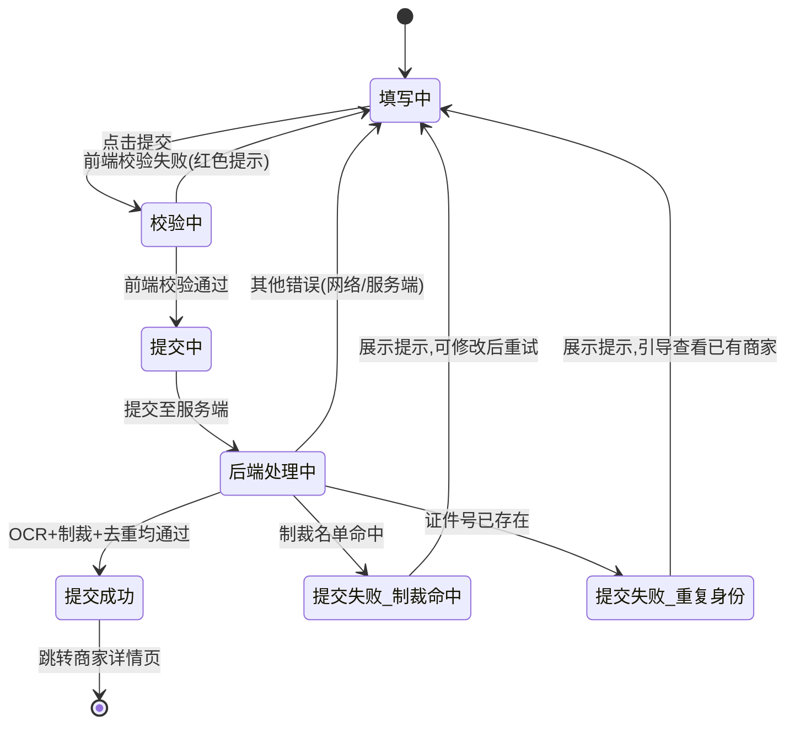

# 22-add-merchant — 添加商家

> 来源：FoneSquare PRD v1.0 · Web 商家管理后台

---

## 1. 页面定位

单页纵向表单，供 admin 和 advisor 录入新商家信息（基本信息 + 个人 KYC + 企业 KYC 选填）。提交后自动触发 OCR 识别、制裁名单检查和重复身份检测，创建商家并根据操作人角色自动处理维护人绑定关系。

---

## 2. 状态机



---

## 3. 组件树

```
AddMerchantPage
├── PageHeader（面包屑：首页 / 商家管理 / 商家列表 / 添加商家）
├── Form（单页纵向表单）
│   ├── Section（基本信息）
│   │   ├── FormItem.Input（商家名称 — 必填）
│   │   ├── FormItem.CheckboxGroup（商家类型 — 买家/卖家多选，必填）
│   │   ├── FormItem.PhoneInput（手机号 — 含区号选择器）
│   │   ├── FormItem.Input（邮箱）
│   │   ├── FormItem.Input（WhatsApp）
│   │   ├── FormItem.Hint（"手机号/邮箱/WhatsApp 三选一必填"）
│   │   └── FormItem.RegionCascader（所在地区 — 三级联动：国家/省/市，必填）
│   ├── Section（个人 KYC）
│   │   ├── FormItem.Select（证件类型 — 按地区动态显示）
│   │   ├── FormItem.Input（证件号 — 必填）
│   │   ├── FormItem.DatePicker（证件有效期 — 不可选过去日期）
│   │   ├── FormItem.ImageUpload（自拍照）
│   │   ├── FormItem.ImageUpload（证件正面）
│   │   └── FormItem.ImageUpload（证件背面 — 护照时隐藏）
│   ├── Section（企业 KYC — 可折叠，选填）
│   │   ├── CollapseHeader（"企业信息（选填）— 填写可提升购买额度"）
│   │   ├── FormItem.Input（公司名称）
│   │   ├── FormItem.Input（商业登记号）
│   │   └── FormItem.ImageUpload（营业执照照片）
│   ├── Section（备注）
│   │   └── FormItem.TextArea（备注 — 选填）
│   └── FormActions
│       ├── Button.Primary（提交）
│       └── Button（取消 — 返回列表）
├── SubmitResultModal（提交结果弹窗）
│   ├── SuccessState（创建成功 → 查看详情/继续添加）
│   ├── SanctionHitState（制裁命中提示）
│   └── DuplicateState（重复身份提示 → 查看已有商家链接）
└── LoadingOverlay（提交中遮罩）
```

---

## 4. 字段清单

### 基本信息

| 字段名 | 类型 | 必填 | 校验规则 | 说明 |
|--------|------|------|----------|------|
| merchant_name | String | 是 | 2-100 字符，不可纯空格 | 商家名称 |
| merchant_type | Enum[] | 是 | 至少选一项：buyer / seller | 商家类型（多选） |
| phone | String | 条件必填 | 含国际区号，格式校验 `+[1-9]\d{0,3} \d{4,15}` | 手机号（三选一必填） |
| email | String | 条件必填 | 标准邮箱格式 RFC 5322 | 邮箱（三选一必填） |
| whatsapp | String | 条件必填 | 含国际区号，同手机号格式 | WhatsApp 号码（三选一必填） |
| country | String | 是 | 三级联动第一级，必须选择 | 国家 |
| province | String | 是 | 三级联动第二级 | 省份/州 |
| city | String | 是 | 三级联动第三级 | 城市/区 |

### 个人 KYC

| 字段名 | 类型 | 必填 | 校验规则 | 说明 |
|--------|------|------|----------|------|
| id_type | Enum | 是 | 按地区动态展示（见下表） | 证件类型 |
| id_number | String | 是 | 非空，≤50 字符 | 证件号码 |
| id_expiry | Date | 是 | 不可选过去日期（≥ 今天） | 证件有效期 |
| selfie_photo | Image | 是 | JPG/PNG，≤ 5MB | 自拍照 |
| id_photo_front | Image | 是 | JPG/PNG，≤ 5MB | 证件正面 |
| id_photo_back | Image | 条件必填 | JPG/PNG，≤ 5MB；护照时非必填 | 证件背面（护照无此项） |

**证件类型动态规则**：

| 选择地区 | 可选证件类型 |
|----------|-------------|
| 香港 (HK) | 香港身份证 / 护照 |
| 澳门 (MO) | 澳门身份证 / 护照 |
| 中国大陆 (CN) | 居民身份证 / 护照 |
| 其他地区 | 仅护照 |

### 企业 KYC（选填）

| 字段名 | 类型 | 必填 | 校验规则 | 说明 |
|--------|------|------|----------|------|
| company_name | String | 否 | ≤200 字符 | 公司名称 |
| business_reg_number | String | 否 | ≤100 字符 | 商业登记号 |
| license_photo | Image | 否 | JPG/PNG/PDF，≤ 10MB | 营业执照照片 |

### 备注

| 字段名 | 类型 | 必填 | 校验规则 | 说明 |
|--------|------|------|----------|------|
| remark | String | 否 | ≤500 字符 | 备注信息 |

---

## 5. 交互规则

| 编号 | 规则 |
|------|------|
| IR-001 | 页面为单页纵向滚动表单，非分步向导 |
| IR-002 | 商家类型为多选 Checkbox：买家 / 卖家（至少选一项） |
| IR-003 | 手机号/邮箱/WhatsApp 三者至少填写一项，未满足时提交按钮置灰且红色提示 "至少填写一种联系方式" |
| IR-004 | 所在地区三级联动：选择国家后加载省份列表，选择省份后加载城市列表 |
| IR-005 | 选择国家/地区后自动重置证件类型下拉选项（按上表规则动态展示） |
| IR-006 | 证件有效期日期选择器禁用过去日期（min = 今天） |
| IR-007 | 护照类型时隐藏「证件背面」上传项 |
| IR-008 | 企业 KYC 区域默认折叠，点击展开后字段变为必填（如果开始填写） |
| IR-009 | 图片上传支持拖拽或点击，上传中显示进度条，上传完成显示缩略图，可删除重传 |
| IR-010 | 「取消」按钮弹出确认弹窗 "确认放弃当前填写的信息？"，确认后返回商家列表 |
| IR-011 | 「提交」按钮点击后前端先校验全部必填项和格式，通过后提交至服务端 |
| IR-012 | 提交期间展示全屏 Loading 遮罩 + "提交中..." 文案，禁止重复提交 |
| IR-013 | 提交成功后弹窗显示 "商家创建成功"，提供「查看详情」和「继续添加」两个按钮 |
| IR-014 | 制裁名单命中时弹窗警告 "该用户命中制裁名单，无法创建"，红色图标 |
| IR-015 | 重复身份检测命中时弹窗提示 "该证件信息已关联商家 [脱敏名称]"，提供「查看已有商家」链接 |
| IR-016 | 备注字段展示剩余可输入字符数（如 "剩余 450/500"） |

---

## 6. 业务规则

| 编号 | 规则 |
|------|------|
| BR-001 | admin 提交 → 维护人字段默认为 "未分配"，需后续在详情页手动绑定 |
| BR-002 | advisor 提交 → 自动绑定本人为维护人（维护人 = 当前登录人的 OB 账号） |
| BR-003 | 提交后触发异步流程：① OCR 识别（提取证件信息并校验一致性）② 制裁名单检查（OFAC/UN/EU）③ 重复身份检测（证件类型 + 证件号查重） |
| BR-004 | OCR 可信度 < 60% 时自动拒绝，提示重新上传证件照 |
| BR-005 | 制裁名单命中 → 商家创建但状态标记为「账号受限」，风控后台可查看 |
| BR-006 | 重复身份检测命中 → 拒绝创建，返回已有商家信息（脱敏） |
| BR-007 | 新建商家默认状态：`active`（使用）；认证状态：提交了 KYC 信息则进入校验流程，否则为 `unverified` |
| BR-008 | 商家 ID 由系统自动生成，格式非自增数字（如 UUID 或自定义编号规则） |
| BR-009 | 添加商家需具备「添加商家」功能权限（admin/advisor 默认拥有） |
| BR-010 | 限额/保证金不在添加页配置，创建后到详情页 Tab 3 配置 |
| BR-011 | 创建操作写入操作日志（操作人、创建时间、创建方式：admin 手动 / advisor 手动） |

---

## 7. 前端实现要点

### 路由
```
/merchant/add       — 添加商家页面
```

### 状态管理
- **表单数据**：组件级 State，离开页面前若已填写内容需拦截提示
- **地区联动数据**：国家列表首屏加载，省/市列表按需懒加载
- **证件类型选项**：响应式依赖 `country` 字段变更自动切换
- **三选一校验**：watch `phone` / `email` / `whatsapp`，至少一个非空
- **图片上传**：独立上传逻辑，上传成功后获取 `file_url` 存入表单 State

### API 调用

| 接口 | 方法 | 说明 |
|------|------|------|
| `POST /api/merchants` | POST | 提交表单创建商家 |
| `GET /api/regions/countries` | GET | 获取国家列表 |
| `GET /api/regions/:countryCode/provinces` | GET | 获取省份列表 |
| `GET /api/regions/:countryCode/:provinceId/cities` | GET | 获取城市列表 |
| `POST /api/upload/image` | POST | 图片上传（证件照/执照照片） |

---

## 8. 后端实现要点

### 校验逻辑
- 必填字段非空校验
- 商家名称长度 2-100
- 手机号/邮箱/WhatsApp 三选一非空
- 邮箱格式校验
- 手机号/WhatsApp 格式校验（含国际区号）
- 证件有效期 ≥ 当前日期（UTC+8）
- 证件类型与地区匹配校验
- 图片文件类型（JPG/PNG）和大小（≤5MB / ≤10MB）校验

### 数据库操作
- 事务操作：
  1. `INSERT INTO merchant (...)` 创建商家记录
  2. `INSERT INTO merchant_kyc (...)` 创建 KYC 记录
  3. `INSERT INTO merchant_enterprise_kyc (...)` 创建企业 KYC（如有）
  4. `INSERT INTO advisor_bindlog (...)` 写入维护人绑定记录（advisor 提交时）
  5. `INSERT INTO operation_log (...)` 写入操作日志

### 事件触发
- 商家创建成功后发送异步消息：
  - **OCR 识别任务**：将证件照 URL 发送至 OCR 服务队列，返回识别结果与一致性评分
  - **制裁名单检查任务**：将姓名 + 证件号 + 国籍发送至风控服务，校验 OFAC/UN/EU 名单
  - **重复身份检测任务**：以 `id_type + id_number` 查询已有商家，若命中则标记为重复
- OCR/制裁/去重结果回写：
  - 全部通过 → `merchant.kyc_status = 'verified'`
  - 制裁命中 → `merchant.kyc_status = 'restricted'`，发通知至风控后台
  - 重复身份 → 根据业务规则处理（标记或拒绝）
- 操作日志记录包含：创建人角色（admin/advisor）、创建时间、是否自动绑定维护人
