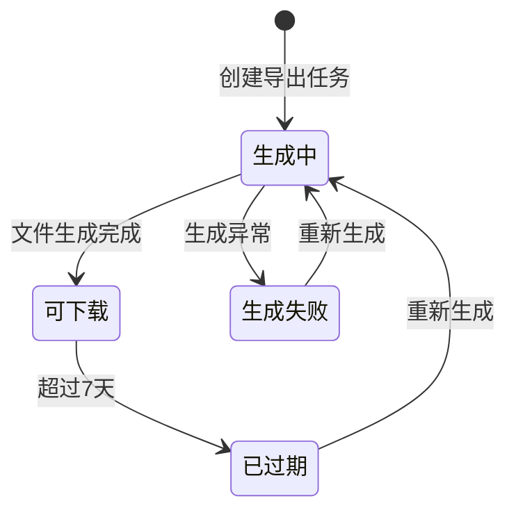

# 23-download-center — 下载中心

> 来源：FoneSquare PRD v1.0 · Web 商家管理后台

---

## 1. 页面定位

侧边菜单「下载中心 → 我的文件」入口，展示当前登录用户创建的所有异步导出任务及其文件状态，支持下载已生成的 Excel 文件或对已过期文件发起重新生成。

---

## 2. 状态机



---

## 3. 组件树

```
DownloadCenterPage
├── PageHeader（面包屑：首页 / 下载中心 / 我的文件）
├── FileTable（文件列表表格）
│   ├── Column（文件名）
│   ├── Column（文件大小）
│   ├── Column（创建时间）
│   ├── Column（状态 — Tag）
│   │   ├── Tag.Blue（生成中 — 带 Spin 图标）
│   │   ├── Tag.Green（可下载）
│   │   ├── Tag.Red（生成失败）
│   │   └── Tag.Gray（已过期）
│   └── Column（操作）
│       ├── Button.Link（下载 — 可下载状态时启用）
│       ├── Button.Link（重新生成 — 已过期/生成失败时展示）
│       └── Button.Disabled（下载 — 生成中时置灰）
├── Pagination（分页器：10/20 条/页）
├── EmptyState（空状态："暂无导出文件"）
└── AutoRefreshIndicator（自动刷新指示器 — 有生成中任务时）
```

---

## 4. 字段清单

| 字段名 | 类型 | 必填 | 校验规则 | 说明 |
|--------|------|------|----------|------|
| file_id | String | — | — | 文件唯一标识 |
| file_name | String | — | — | 文件名（自动生成，如 "商家列表导出_20260507_143000.xlsx"） |
| file_size | String | — | — | 文件大小（如 "1.2 MB"），生成中时显示 "—" |
| created_at | DateTime | — | — | 任务创建时间，格式 YYYY-MM-DD HH:mm |
| status | Enum | — | generating / ready / expired / failed | 文件状态 |
| download_url | String | — | — | 文件下载地址（OSS 签名 URL），仅 ready 状态有值 |
| expire_at | DateTime | — | — | 过期时间（created_at + 7 天） |
| export_params | JSON | — | — | 导出时的筛选条件快照（用于重新生成） |
| creator_id | String | — | — | 创建人 OB 账号 ID |

---

## 5. 交互规则

| 编号 | 规则 |
|------|------|
| IR-001 | 列表按创建时间倒序排列，最新任务在最上方 |
| IR-002 | 「生成中」状态：下载按钮置灰不可点击，状态列展示旋转加载图标 |
| IR-003 | 「可下载」状态：点击「下载」触发浏览器下载 Excel 文件 |
| IR-004 | 「已过期」状态（创建时间 > 7 天）：隐藏下载按钮，展示「重新生成」按钮 |
| IR-005 | 「生成失败」状态：展示「重新生成」按钮 + 红色 "生成失败" Tag |
| IR-006 | 「重新生成」点击后复用原导出参数创建新任务，新任务出现在列表最上方 |
| IR-007 | 当列表中存在「生成中」状态的任务时，每 10 秒自动轮询刷新列表状态 |
| IR-008 | 无文件时展示空状态插图 + 文案 "暂无导出文件，请先在商家列表页发起导出" |
| IR-009 | 文件名格式固定：`{导出类型}_{日期}_{时间}.xlsx`（如 "商家列表导出_20260507_143000.xlsx"） |
| IR-010 | 分页支持 10 / 20 条/页切换 |

---

## 6. 业务规则

| 编号 | 规则 |
|------|------|
| BR-001 | 仅展示当前登录用户创建的导出任务（`WHERE creator_id = :currentUserId`） |
| BR-002 | advisor 导出的文件内容受数据权限限制——仅包含其维护的商家数据 |
| BR-003 | 文件保留期限为 7 天（168 小时），超过后自动标记为已过期 |
| BR-004 | 已过期文件的 OSS 存储对象同步删除（定时任务执行） |
| BR-005 | 重新生成使用原导出时的筛选条件快照，但数据为最新数据 |
| BR-006 | 同一用户同时最多允许 3 个「生成中」状态的导出任务，超出时提示 "您有进行中的导出任务，请稍后再试" |
| BR-007 | 导出 Excel 表头包含：商家ID、商家名称、商家类型、所在地区、认证状态、商家状态、维护人、创建时间 |
| BR-008 | 导出数据中敏感信息脱敏：手机号/邮箱按脱敏规则处理，证件信息不导出 |
| BR-009 | 下载操作不记入操作日志（非敏感操作） |
| BR-010 | 导出文件格式为 `.xlsx`（Excel 2007+）|

---

## 7. 前端实现要点

### 路由
```
/download-center        — 下载中心（我的文件）
```

### 状态管理
- **文件列表**：请求级 State，进入页面时加载
- **轮询逻辑**：当列表中存在 `status === 'generating'` 的记录时，启动 `setInterval(10000)` 轮询 `GET /api/exports`；所有任务完成后停止轮询
- **分页状态**：URL query params `?page=1&size=10`

### API 调用

| 接口 | 方法 | 说明 |
|------|------|------|
| `GET /api/exports` | GET | 查询当前用户的导出任务列表 `?page=1&size=10` |
| `POST /api/exports/:id/regenerate` | POST | 重新生成已过期/失败的导出任务 |
| `GET /api/exports/:id/download` | GET | 获取下载链接（302 重定向至 OSS 签名 URL） |

### 下载实现
```
点击下载 → GET /api/exports/:id/download → 302 redirect to OSS signed URL → 浏览器自动下载
```

---

## 8. 后端实现要点

### 校验逻辑
- 列表查询：`WHERE creator_id = :currentUserId`，仅返回当前用户的任务
- 重新生成：校验原任务属于当前用户 + 状态为 `expired` 或 `failed`
- 下载：校验文件属于当前用户 + 状态为 `ready` + 未过期
- 并发限制：查询 `SELECT COUNT(*) FROM export_task WHERE creator_id = :uid AND status = 'generating'`，≥ 3 时拒绝

### 数据库操作
- 任务列表：`SELECT * FROM export_task WHERE creator_id = :uid ORDER BY created_at DESC LIMIT :size OFFSET :offset`
- 创建导出任务（来自商家列表页）：`INSERT INTO export_task (creator_id, export_params, status, created_at) VALUES (:uid, :params, 'generating', NOW())`
- 重新生成：`INSERT INTO export_task (creator_id, export_params, status, created_at) VALUES (:uid, :originalParams, 'generating', NOW())`
- 任务完成：`UPDATE export_task SET status = 'ready', file_url = :url, file_size = :size, file_name = :name WHERE id = :taskId`
- 过期清理：定时任务 `UPDATE export_task SET status = 'expired' WHERE status = 'ready' AND created_at < NOW() - INTERVAL 7 DAY`

### 事件触发
- 导出任务创建后发送消息至消息队列（如 RabbitMQ / SQS）
- Worker 消费消息：
  1. 根据 `export_params` 查询商家列表（含数据权限过滤）
  2. 生成 Excel 文件（使用 EasyExcel / Apache POI / openpyxl 等）
  3. 上传至 OSS，获取文件 URL
  4. 更新 `export_task` 状态为 `ready`
  5. 异常时更新状态为 `failed`，记录错误原因
- 定时任务（每日凌晨执行）：
  1. 将超过 7 天的 `ready` 状态任务标记为 `expired`
  2. 删除对应 OSS 文件对象
